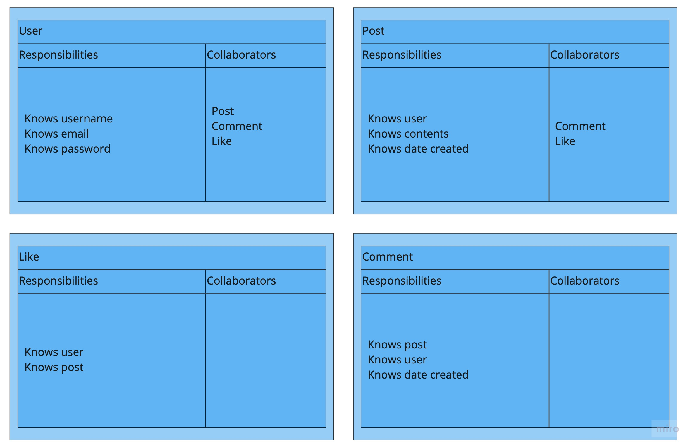

# Instagram Challenge
The aim of this project is to build a clone of Instagram using Ruby on Rails.

## Instructions
To use this project please execute the following commands in the command line:
```
> bundle install
> bin/rails db:create
> bin/rails db:migrate
> bin/rails server 
```
The site should now be running at localhost:3000

To run test please execute `bundle exec rspec` 

## Specification (🔴 TODO, 🟢 Complete)
* Users can post pictures  🟢
* Users can comment on pictures 🔴
* Users can like pictures 🔴
* Users can edit pictures using filters 🔴

## User stories
```
As a user,
So that I can share images,
I want to post images
```
```
As a user,
So that I can share my opinion,
I want to comment on images
```
```
As a user,
So that I can show I like an image,
I want to like images
```
```
As a user,
So that I can fool the world,
I want to use filters on my images
```

## CRC cards

