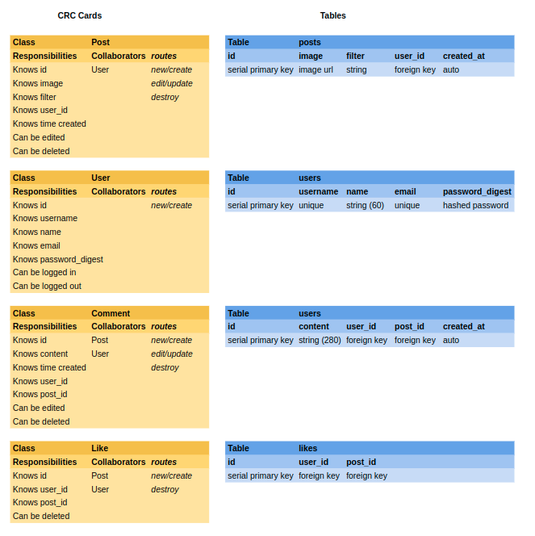

# Instagram Challenge

Build Instagram: Simple huh!

Your challenge is to build Instagram using Rails. You'll need **users** who can post **pictures**, write **comments** on pictures and **like** a picture. Style it like Instagram's website (or more awesome).

Bonus if you can add filters!

## User Stories

I extracted user stories from the short brief above.

### Authentication

- [x] 1.1

> As a Potential User  
> I can sign up for an account  
> So that I can post my own photos

- [x] 1.2

> As a User with an existing account  
> I can sign in to my account  
> So that I can post photos and make comments as me

- [x] 1.3

> As a Signed In User  
> I can sign out of my account  
> So that I can prevent people posting as me

### Posting

- [x] 2.1

> As a Signed In User  
> I can post a photo  
> So everyone can see what I'm doing

- [x] 2.2

> As a Signed In User  
> I can choose from several filters and apply them to my photo  
> So I can express my artistic side

- [x] 2.2.1

> As a Signed In User  
> I can see a preview of my photo, with the filter I select applied  
> So I can choose the best filter for my photo

- [x] 2.3

> As a Signed In User  
> I can change the filter on my photo  
> In case I don't like that filter any more

- [x] 2.3.1

> As a Signed In User  
> I can only see the option to edit on my own photos  
> So I cannot alter anyone else's photos

- [x] 2.4

> As a Signed In User  
> I can delete my photos  
> So I can erase embarrassing memories

- [x] 2.4.1

> As a Signed In User  
> I can only see the option to delete on my own photos  
> So I cannot delete anyone else's photos

- [x] 2.5

> As a User  
> I can see a feed of photos, newest to oldest  
> So I can see what is going on with everyone recently

- [x] 2.5.1

> As a User  
> I can see the time of a post  
> So I know how recently it was posted

- [x] 2.5.2

> As a User  
> I can see the user who made a post  
> So I know how who made it

### Commenting

- [x] 3.1

> As a Signed In User  
> I can comment on a photo  
> So I can that user them what I think of it

- [ ] 3.2

> As a Signed In User  
> I can edit a comment I have made  
> So I can correct spelling errors

- [ ] 3.3

> As a Signed In User  
> I can delete a comment I have made  
> So I can erase embarrassing things I have said

- [x] 3.4

> As a User  
> I can see all comments on a photo from newest to oldest  
> So I can see the freshest opinions on my photo

- [x] 3.4.1

> As a User  
> I can see the username of who made a comment  
> So I can tell who is interacting with me

- [x] 3.4.2

> As a User  
> I can see the time a comment was made  
> So I can understand how quickly people commented

- [x] 3.5

> As a User  
> I can only comment when signed in  
> So my username can be displayed on the comment

### Liking

- [ ] 4.1

> As a Signed In User  
> I can like a photo  
> So I can show appreciation without commenting

- [ ] 4.2

> As a Signed In User  
> I rescind a like  
> In case I change my mind about liking that photo

- [ ] 4.3

> As a User  
> I can see how many likes a photo has  
> So I can estimate my popularity

- [ ] 4.4

> As a User  
> I should only be able to like when signed in  
> So that liking is fair and accurate representation of popularity

### Style

- [ ] 5.1

> As a Potential User  
> So that I am enticed to join  
> The site should be well styled

## Domain Modelling

Based on the user stories I wrote some CRC cards, and made table schema:



## Development Journal

### Initialising Rails

This project may eventually be deployed to Heroku, so I will initialise it with a Postgresql database, in this repo:

```shell
rails new . --database=postgresql
```

Next I added rspec-rails to the development and test groups in the Gemfile, bundled, and installed with:

```shell
rails generate rspec:install
```

I also added simplecov, and simplecov-console to check code coverage, and Rubocop for linting.

### User Sign Up

- [x] 1.1

> As a Potential User  
> I can sign up for an account  
> So that I can post my own photos

These first three user stories are all related to authentication. This is perhaps a bigger challenge to start with, but it is so linked to ultimate form of many other user stories, that I feel it will be good to get out of the way early.

Feature test: User signs up through users/new form and sees their username. (Happy Path). Red.

- Generated a users controller with new and create routes with `rails g controller users`.
- Generated a User model according to the schema with `rails g model user username:string{20}:uniq name:string{60} email:string{60}:uniq password_digest:string`.
- Migrated the database with `db:migrate`.
- Added a form with scope for the user, posting to the `users_path` (which will go to create by default).
- Added to the routes config a resource for users, allowing only new and create
- Added a user create route. It renders the `params` for now.
- Added bcrypt to the Gemfile.
- Added `has_secure_password` helper method to User model. (this causes the `User.create` method to encrypt password with bcrypt).
- In the user create route, created a user with `User.create`, passing in `user_params`.
- `user_params` is a method that returns the permitted user parameters.
- The users id is added to the `session` and the route redirects to '/'.
- Added a sessions controller with `rails g controller sessions` (this controller will provide routes for the existing user log in page, as well as the welcome page).
- Added index route to sessions, and added this as the root in routes config.
- Added a couple of helper methods to the application controller: `current_user`, which finds returns a user based on the `session` user id, and `logged_in?`, which returns true if the `current_user` is not nil.
- Both of these helper methods are exposed using the `helper_method` method.
- In the sessions/index view added some executive ruby to render "Hello `username`" if logged in.

Test green.

Feature test: User signs up through users/new form, tries existing username, and sees error. (Unhappy Path). Red.

- Added to User model that it validates username as unique.
- Refactored user create route to use `User.new` instead of `User.create`.
- Then if `@user.save` is true (i.e. it was able to be written, and no errors with unique username), assign id to `session` and redirect to '/'
- else assign `@errors` with `@user.errors` and render 'new'.
- Added to users new view executive ruby for if `@error` render a h2 element with This username or email already in use.

Green.

Feature test: User signs up through users/new form, tries existing email, and sees error. (Unhappy Path). Red.

- Added to User model validation for email uniqueness.

Green.

### User Log In

- [x] 1.2

> As a User with an existing account  
> I can sign in to my account  
> So that I can post photos and make comments as me

Feature test: User logs in through sessions/new form, correct password, and sees their username. (Happy Path). Red.

- Added a form to sessions/new view with scope for user, posting to `sessions_path` which will go to sessions create.
- Added sessions create route.
- Found the user by username.
- Added the user id to `session`.
- redirected to '/'.

Green.

Feature test: User logs in through sessions/new form, WRONG password, and sees error. (Unhappy Path). Red.

- In sessions create route, added an if authenticating the user with `@user.authenticate(user_params[:password])` returns true, assign user id to `session` and redirect to '/'.
- else `@error` is true, and render 'new'
- Added executive ruby, if `@error` render a h2 element with "Incorrect username or password".

Green.

Feature test: User logs in through sessions/new form, WRONG username, and sees error. (Unhappy Path). Red.

- In sessions create, added `@user` to the if statement, to check if the user was actually found.

Green.

### User Log Out

- [x] 1.3

> As a Signed In User  
> I can sign out of my account  
> So that I can prevent people posting as me

Feature test: User is logged in, then clicks log out button, no longer sees their username. Red.

- Added to the sessions controller a route for destroy.
- On sessions index view added a button to sessions with method of delete.
- In routes config, switched sessions to `resources` to `resource` (to allow deletion without specifying an id, there is only ever one session).
- Added destroy route to sessions controller, clearing the `session` and redirecting to '/'.

Green.

Refactoring:

- Cleaned up excess routes by specifying only sessions index, new, create, destroy.
- Switched to using `root_path` instead of redirecting to '/'.

### Making a Post

- [x] 2.1

> As a Signed In User  
> I can post a photo  
> So everyone can see what I'm doing

Feature test: User can make a post. Red.

- Generated post model with `rails g model post filter:string user:references`.
- Generated posts controller with `rails g controller posts`.
- Added to User model, has many posts.
- Added posts resources nested within user resources in routes config.
- Added button to root view to make new post, going to the new user post path, passing in the current user.
- Added route for new posts.
- Added view for new posts, with form to build a post for current user.
- Added a route to create post, creating a post on the current user with the params from the form, redirecting to root_path.
- Added executive ruby to the sessions index view if the user is logged in, to loop through their posts and render them.

Green.

### Adding Filters

- [x] 2.2

> As a Signed In User  
> I can choose from several filters and apply them to my photo  
> So I can express my artistic side

Feature test: User can make a post and choose a filter. Red.

- Added a select to the new post form choosing from several filter options, with blank as true.
- Added filter to the permitted params for posts.
- Added to Post model a method `filter_class`, interpolating the Posts filter into a string to create the BEM class for the post.
- In sessions index posts render loop Added to the image tag a class of `post.filter_class`.

Green.

Added some SCSS to actually do something with the filter classes.
Also fixed bug for filter being unset and `filter_class` returning just the first part of the BEM class using guard clause.

- [x] 2.2.1

> As a Signed In User  
> I can see a preview of my photo, with the filter I select applied  
> So I can choose the best filter for my photo

Feature test: User can preview filter on image. Red.

- Added an image to the form with an empty src attribute and id of `previewImage`.
- Added a new JavaScript file in `post/index.js` and required it into the application js.
- Used JavaScript to add an event listener to the image upload input, and on change pass the file through a `FileReader` to get a DataUrl which is then set to the `previewImage`'s src.
- Also added an event listener to the filter select and applied the a filter class based on the selection to the preview image.

Green. _I had a lot of trouble working out how to actually get Capybara to register the change of class based on the filter selection. It turned out I needed to enable js for the scenario, so I have configured chrome to run in headless mode for these tests._

### Editing Post Filter

- [x] 2.3

> As a Signed In User  
> I can change the filter on my photo  
> In case I don't like that filter any more

Feature test: User can click on a post, click to edit it, and change filter on a post. Red.

- Added a link wrapping each post's image on index to view that post.
- Added route and view for show post, with link to edit that post.
- Added post edit view rendering its image, and allowing select for new filters.
- Added update route to post controller, saving the new filter, redirecting back to the post show route.

- [x] 2.3.1

> As a Signed In User  
> I can only see the option to edit on my own photos  
> So I cannot alter anyone else's photos

Feature test: User clicks on another users post, expects not to see edit option. Red.

- Added helper method `owner?` to post controller, checking that the post's user is the `current_user`.
- Stored the result of `owner?` in a variable, and conditionally rendered the edit link on the show view.

Green.

### Deleting Posts

- [x] 2.4

> As a Signed In User  
> I can delete my photos  
> So I can erase embarrassing memories

Feature test: User clicks on post, clicks delete, and accepts warning, post is deleted.

- In posts show view added link to delete.
- In posts controller added destroy route, destroying the post and redirecting to root.

Green.

- [x] 2.4.1

> As a Signed In User  
> I can only see the option to delete on my own photos  
> So I cannot delete anyone else's photos

Refactored the previous edit test to a new feature test to encompass similar behaviour: User clicks on another users post, expects not to see edit or delete option. Red.

- Moved delete button within owner conditional render.

Green.

### Listing Posts

- [x] 2.5

> As a User  
> I can see a feed of photos, newest to oldest  
> So I can see what is going on with everyone recently

Feature test: User should see all posts on index, newest first. Red.

- In sessions controller index route added order to `Post.all` call, ordering by `created_at` descending.

Green.

### Times on Posts

- [x] 2.5.1

> As a User  
> I can see the time of a post  
> So I know how recently it was posted

Feature test: Posts listed with time, in list and show. Red.

- Added to Post model a method `formatted_time` that returns `created_at` as the correct formatted string.
- Added in the sessions index view executive ruby that displays the post's `formatted_time`.
- Due to BST, added a time zone configuration to `application.rb` in config.
- Added in the post show view the post's `formatted_time` also.

Green.

### Usernames on Posts

- [x] 2.5.2

> As a User  
> I can see the user who made a post  
> So I know how who made it

Feature test: Posts listed with username, in list and show. Red.

- Added to Post model a method `username` that returns the post's user's username.
- Added in the sessions index view executive ruby that displays the post's `username`.
- Added in the post show view the post's `username` also.

Green.

_Later on, refactored to use Rails' delegate method._

### Adding Comments

- [x] 3.1

> As a Signed In User  
> I can comment on a photo  
> So I can that user them what I think of it

Feature test: User can comment on a post. Red.

- Generated Comment model based on table schema using: `rails g model comment user:references post:references content:string{280}`.
- Generated comments controller using: `rails g controller comments`.
- Migrated the db.
- Added to Post model to have many comments, with destroy dependency (comments can't exist if the post they are on is gone).
- Added form on the post show view to add a comment.
- Nested comments resources within posts resources in routes config.
- Added comment_params to require comment and permit content.
- Added create route on comments finds the post, and creates a new comment on it.
- Then set that comment's `user_id` to the current_user's id (comments need to be associated with a user in order to be saved).
- Then redirect to the post.
- Added rendering of all post's comments on the post show view.

Green.

### Editing Comments

- [ ] 3.2

> As a Signed In User  
> I can edit a comment I have made  
> So I can correct spelling errors

This has been very difficult to implement for some reason. See [`edit-comments`](https://github.com/hturnbull93/instagram-challenge/tree/edit-comments) branch for the work towards it.

I seem to not be able to render the correct link to the comment on the post show view.

### Deleting Comments

- [ ] 3.3

> As a Signed In User  
> I can delete a comment I have made  
> So I can erase embarrassing things I have said

For similar reasons to above, I will return to this user story.

### Listing Comments

- [x] 3.4

> As a User  
> I can see all comments on a photo from newest to oldest  
> So I can see the freshest opinions on my photo

Feature test: Comments appear newest first. Green. I guess the comments are rendered in this order by default.

### Comments have Username

- [x] 3.4.1

> As a User  
> I can see the username of who made a comment  
> So I can tell who is interacting with me

Feature test: Comments have username. Red.

- Comment model delegates username to user, allowing nil (for some reason there is a comment existing on the post. Not sure why, but it has no user, so to avoid error must allow nil).
- User model has many comments through posts.
- Added username to comments render in view.

Green.

### Comments have Time

- [x] 3.4.2

> As a User  
> I can see the time a comment was made  
> So I can understand how quickly people commented

Feature test: Comments have time. Red.

- Added `formatted_time` method to Comment model, similar to the one on Post model.
- Added this to the comments render.

Green.

### Comment Only When Signed In

- [x] 3.5

> As a User  
> I can only comment when signed in  
> So my username can be displayed on the comment

Feature Test: User cannot see comment form if signed out. Red.

- Added conditional rendering of comment form based on `logged_in?`.

Green.

### Adding a Like

- [ ] 4.1

> As a Signed In User  
> I can like a photo  
> So I can show appreciation without commenting

Feature test: Users can add a like to a post. Red.

- Created Likes model according to table schema using: `rails g model like user:references post:references`.
- Added to post that it has many likes.
- 
<!--

### Removing a Like

- [ ] 4.2

> As a Signed In User  
> I rescind a like  
> In case I change my mind about liking that photo

### Counting Likes

- [ ] 4.3

> As a User  
> I can see how many likes a photo has  
> So I can estimate my popularity

### Like Only When Signed In

- [ ] 4.4

> As a User  
> I should only be able to like when signed in  
> So that liking is fair and accurate representation of popularity

