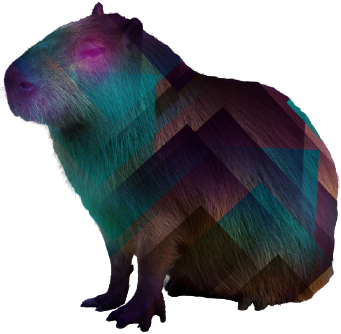

# Instagram Challenge

## Learning Objectives
* Implement Devise and learn to use it for basic user authentication
* Learn how to implement image uploads using ActiveStorage

## Usage

### Web

Browse to: https://gramstaham.herokuapp.com/

### Local

```
$ git clone git@github.com:s-palmer/instagram-challenge.git
```
```
$ cd instagram-challenge
```
```
$ bundle install
```
```
$ rails db:create
$ rails db:migrate
```
```
$ rails s
```

Browse to localhost:3000 to get started.
## User Stories
```
As a user
So I can join Instagram
I want to be able to sign up
```
```
As a user
So I can make a post
I want to be able to sign in
```
```
As a user
So I can end my session
I want to be able to log out
```
```
As a user
So I can share photos
I want to be able to post a photo to the feed
```
```
As a user
So I can appreciate posts
I want to be able to like them
```
```
As a user
So I can leave feedback
I want to be able to write comments on posts
```

## Diagramming


## Stack

|                                                                  | Tool                                                 | Use?                                       | Where can I see it?                                              |
| ---------------------------------------------------------------- | ---------------------------------------------------- | ------------------------------------------ | ---------------------------------------------------------------- |
|      | [RSpec](https://rspec.info/)                         | RSpec is a computer domain-specific language testing tool used to test Ruby code.                      | `/spec/*` Unit tests for the app's classes.                      |
|   | [Capybara](https://github.com/teamcapybara/capybara) | Capybara is a web-based test automation software        | `/spec/features/*` Feature testing for the app. e.g. Sign in/out |
|       | [PostgreSQL](https://www.postgresql.org)             | PostgreSQL is an open-source relational database management system                  | `/db/migrations/*` In the SQL commands below.                    |
|      | [Ruby on Rails](https://rubyonrails.org/)               | Rails is a web-application framework that includes everything needed to create database-backed web applications according to the Model-View-Controller (MVC) pattern. | -----  |
|  | [Tailwind CSS](https://tailwindcss.com/)               | A utility-first CSS framework      | Frontend design

## Workflow

* Used a git hook to prevent committing if Rubocop has errors.

