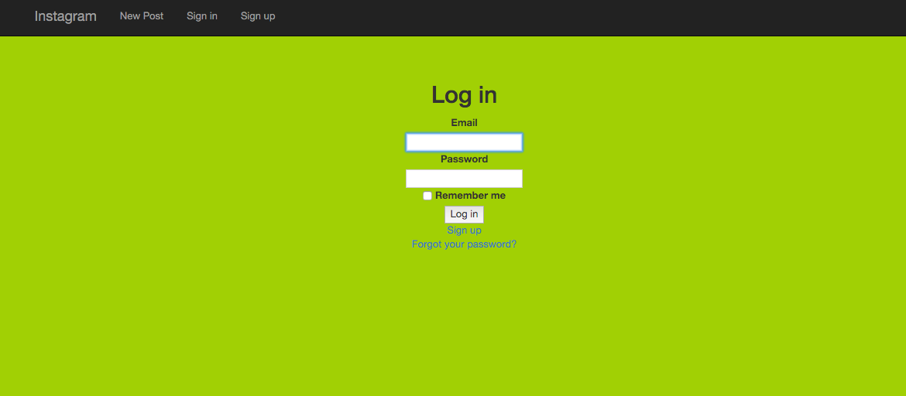
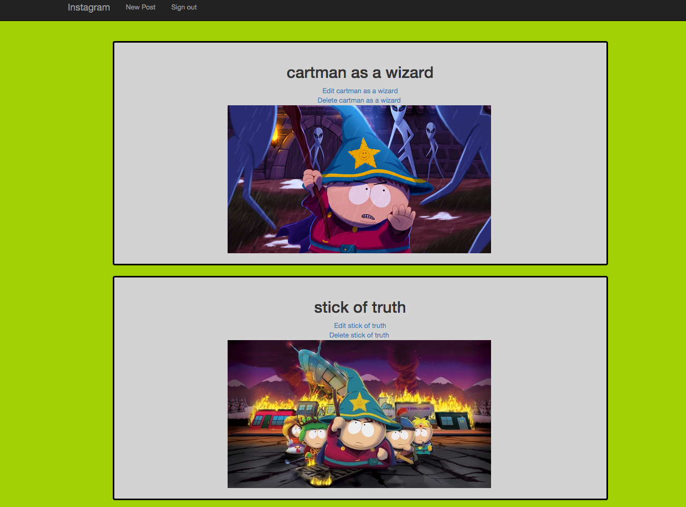

Instagram Challenge
===================
update so you must sign in before you can add a post



home page to see other posts




### Instructions

```
$ git clone http
$ bundle
$ bin/rake db:create
$ bin/rake db:migrate
$ rails s
```

You need to have imagemagick to do stuff, install this by running
```
$ brew install imagemagick
```
Go to `localhost:3000`.

then you have the instagram clone to play with, start by signing up
then you can upload images with a text of your chose.

### Things i did not complete

I would have liked to add a comment section were you can have your say on a picture
I would have all so liked to add a like button, but as always this was a weekend challenge and ran out of time.
-------
* Challenge time: Friday, the entire day + the weekend if you need it
* Feel free to use Google, your notes, books, etc., but work on your own
* If you refer to the solution of another coach or student, please put a link to that in your README
* If you have a partial solution, **still check in a partial solution**
* You must submit a pull request to this repo with your code by 9am Monday morning

Task
-----

Build Instagram: Simple huh!

Bonus if you can write your own set of sensible user stories!

As usual please start by

* Filling out your learning plan self review for the week: https://github.com/makersacademy/learning_plan_october2015 (if you haven't already)
* Forking this repo. After cloning your fork and cd'ing into it, you'll need to [initialize a Rails app in the current directory](http://blog.jasonmeridth.com/posts/create-rails-application-in-current-directory/).

Your challenge is to build Instagram using Rails. You'll need **users** who can post **pictures**, write **comments** on pictures and **like** a picture. Style it like Instagram's website (or more awesome).

Bonus if you can add filters!
