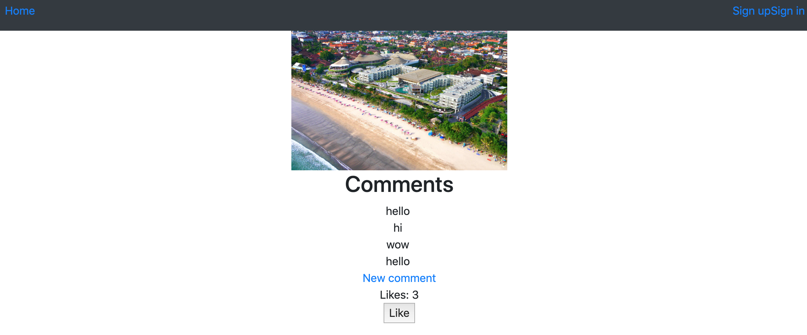
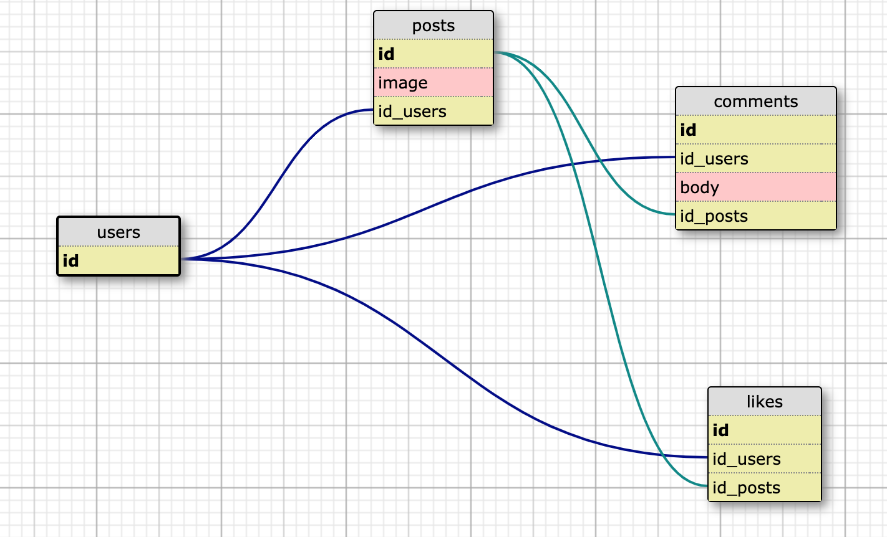

Instagram Challenge
===================

## Task

Build Instagram: Simple huh!

Your challenge is to build Instagram using Rails. You'll need **users** who can post **pictures**, write **comments** on pictures and **like** a picture. Style it like Instagram's website (or more awesome).

Bonus if you can add filters!

## Setup instructions 
- Run bundle
- Run 'rails s' to start server
- To run tests: run rspec in directory

# Approach

## User stories

### Part 1
- user can sign up

test: signed up interface with details appear after signed up

- user can sign in

test: signed up interface with details appear after sign in

- user can sign out

test: message signed out

Posting:
- user can post pictures, when signed in

test: feature test that post is visible after posted

- user can write comments on pictures (any pictures), when signed in

first run migrations for pictures
test: feature test that comments appear after posted

- user can like a picture, when signed in

test: feature test that like increases after click is made by user

- user can like a picture, when signed in
test (feature): 

## Steps
1. Diagramic modelling
Diagram:

- created user model, with devise

- created post model (which uploads picture)
beleongs to user

- created comment model
beleongs to user, post

- created like model 
beleongs to user, post

2. Implemented testing of above user stories
- feature test as listed above

2.1 Set up RESTFUL routes in routes.rb
- Users
- posts 
- comments nested under posts
- likes nested under psots

3. Access control 
(only signed in users can post image, comment, like), or it gives an error)
- devise before 

Navbar:
- when signed out: sign in and sign up available

- when signed in: sign out availabe

General:
- have error message shown if clicking on upload your image when no file is attached.

##  Code quality and test coverage
- used rubocop --a

- used simpleCov, excluded some files
- test coverage 95%, performed feature test of user stories above
- did not test unit test of activerecord methods

5. Bootstrap styling
- responsive
- images in columns

## What I didn't do (yet)

- same user cannot like a post more than once

