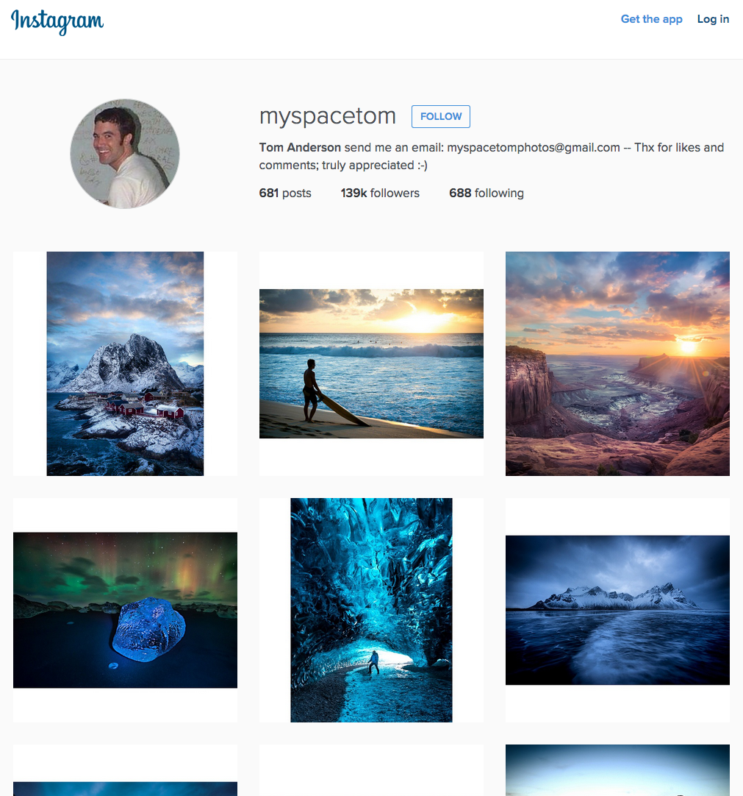

[](https://travis-ci.org/andygout/instagram-challenge)

Instagram Challenge
===================


Challenge:
-----

Build Instagram: Simple huh!

As usual please start by

* Filling out your learning plan self review for the week: https://github.com/makersacademy/learning_plan (if you haven't already)
* Forking this repo

Your challenge is to build Instagram using Rails. You'll need **users** who can post **pictures**, write **comments** on pictures and **like** a picture. Style it like Instagram's website (or more awesome).

Bonus if you can add filters!


User stories:
-------

```
As an avid photographer
I want to be able to post my pictures on the internet
So that I can share them with the world

As a follower of photography
I want to be able to comment on other users' photos
So that I can let the photographer know my thoughts

As a photography enthusiast with little time
I want to be able to quickly 'like' other users' photos
So that I can register my appreciation of the photo
```

Technologies Used:
-------

* Ruby On Rails (full stack, Web application framework)
* Tested using RSpec (provides a behaviour driven development framework for the language, allowing to write application scenarios and test them.)


Set-up Steps:
-----

* `$ gem install rails`
* `$ rails --help` (provides menu)
* `$ rails new . instagram-challenge -d postgresql -T` (`instagram-challenge` - name of app; `-d` - preconfigures app for particular type of database (being overridden to use PostgreSQL); `-T` turns off built-inRails test suite to allow RSpec)
* Start server: `$ bin/rails server` or (shortcut) `$ rails s`
* Create databases: `$ bin/rake db:create RAILS_ENV=test` and `$ bin/rake db:create RAILS_ENV=development`
* Add to test group in `Gemfile`: `'rspec-rails'` and `'capybara'`
* Install newly added gems: `$ bundle`
* Initiate RSpec: `$ bin/rails generate rspec:install` (creates `spec` directory with `spec_helper.rb` and `rails_helper.rb` and `.rspec` file)
* `.rspec` file should include: `-- color` `--format documentation` `--require spec_helper`
* `spec/rails_helper.rb` - add below other require statements: `require 'capybara/rails`
* `spec/features` dir: add first feature test
* `config.routes.rb` add: `root : 'photos#index'` `resources :photos` (`$ bin/rake routes` to display different CRUD (create-read-update-delete) routes created)
* `bin/rails g controller photos` - generates a 'photos_controller.rb` in `app/controllers` and rspec test in `spec/controllers` (delete latter) (`g` = generate)
* `app/controllers/photos_controller.rb` -> define `index` method
* `touch app/views/photos/index.html.erb` -> creates index file for controller to reference
* Generate model: `$ bin/rails g model photo descr:string` (migration files stored in `db/migrate/` - version control system that compiles database upon migration)
* Run migration generated by preceding command: `bin/rake db:migrate` (or poss. `bin/rake db:migrate RAILS_ENV=test` and `bin/rake db:migrate RAILS_ENV=development`)


Next Steps:
-------

* ...


Links:
-------

[Github - Makers Academy: Instagram Challenge](https://github.com/makersacademy/instagram-challenge)


Images:
-------

- Instagram (Tom Anderson @myspacetom)
