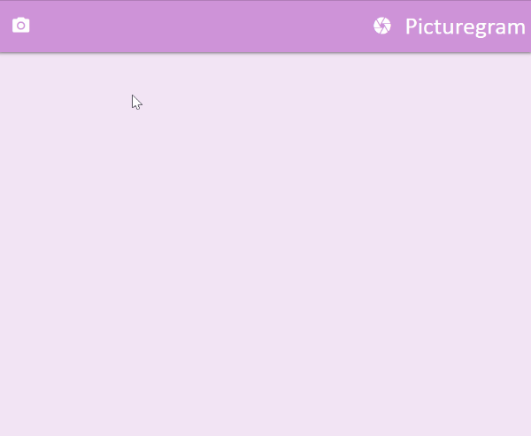

[](https://travis-ci.org/dafuloth/instagram-challenge)
[](https://coveralls.io/github/dafuloth/instagram-challenge?branch=master)
[](https://codeclimate.com/github/dafuloth/instagram-challenge/maintainability)
[](https://codeclimate.com/github/dafuloth/instagram-challenge/test_coverage)

# Instagram clone using Rails

_Week 8 Weekend Challenge: [challenge README.md](./challenge_README.md)_

[See on Heroku](https://dt-instaclonegram.herokuapp.com/), but note **WARNING**: [Storage backend](https://devcenter.heroku.com/articles/active-storage-on-heroku) - e.g. Amazon S3 - is not currently implemented. Heroku filesystem is [ephemeral](https://devcenter.heroku.com/articles/dynos#ephemeral-filesystem), so any file uploads will very quickly be lost with dyno cycling.

I started this project in the weekend between week 8 and week 9, during our [_Acebook_](https://github.com/dafuloth/acebook-bcds) group project. It demonstrates a CI/CD pipeline - i.e. when it is built by Travis CI and passes the tests, it is automatically deployed to Heroku.

It doesn't look like much is happening here because this project was a sandbox for spiking and trying things out. I used it for experimenting and learning new things that I was able to bring to the group project.

Also, I practiced my diagramming here:


## Feature Overview


<div align="center">

### Add a new picture post



### Most recent posts appear first


</div>

## Ruby version

This Rails project was developed with Ruby 2.6.0.

## System dependencies

* PostgreSQL database system

## Getting started

```bash
bundle install
rails db:create
rails db:migrate

```

## Running the tests

This project uses Travis CI/CD which also runs the tests, so rspec output is available in the [Travis repository](https://travis-ci.org/dafuloth/instagram-challenge) job log.

To run locally:

```bash
rake spec

```

The `simplecov` gem is used to measure test coverage and is invoked with each test run. Output is available in the `coverage` directory, in the `./coverage/index.html` file.

This remote repo has `coverage` in `.gitignore` as coverage is being tracked by [Coveralls](https://coveralls.io/github/dafuloth/instagram-challenge).


## Code Quality

Additionally, Code Climate has also been added to track code quality, or "maintainability" - and with `SimpleCov` it also tracks test coverage.

## Issues

### `API request failed` during Travis CI deploy to Heroku

`Message: Invalid credentials provided.`

**Solution**: Refresh `api_key`

```
heroku login
travis login

travis encrypt $(heroku auth:token) --add deploy.api_key
```
Then commit and push the new .travis.yml

## Acknowledgements

* Using free images from [Pixabay](https://pixabay.com/)

## Helpful Gems

* [Acts As Votable (aka Acts As Likeable)](https://github.com/ryanto/acts_as_votable)
* [simple_form](https://github.com/plataformatec/simple_form)
* [mini_magick](https://github.com/minimagick/minimagick)
* [file_validators](https://github.com/musaffa/file_validators)

## Further reading

* [Cheatsheet for Rails](https://devhints.io/rails)
* [Cheatsheet for Devise](https://devhints.io/devise)
* [Cheatsheet for Rake](https://devhints.io/rake)
* [Getting Started on Heroku with Rails 5.x](https://devcenter.heroku.com/articles/getting-started-with-rails5)
