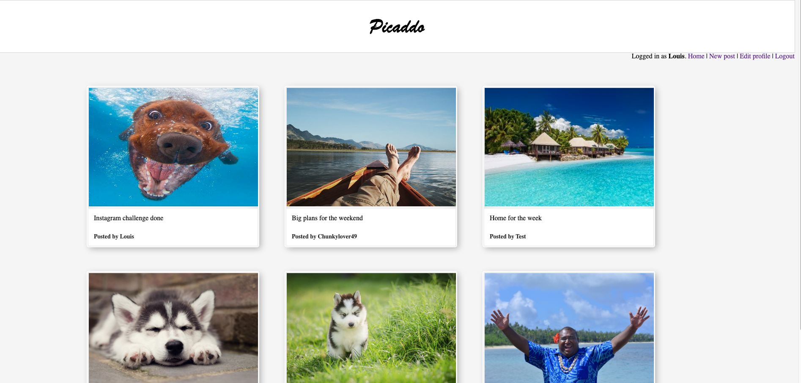
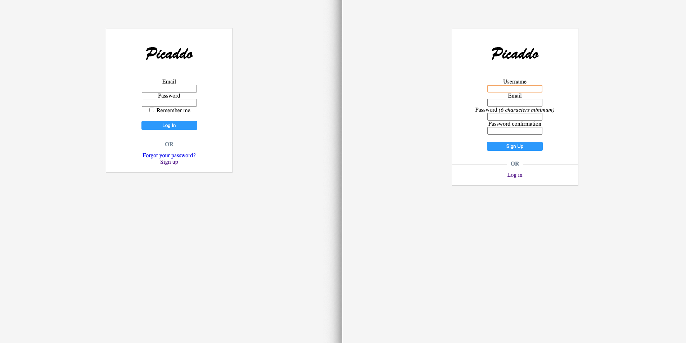
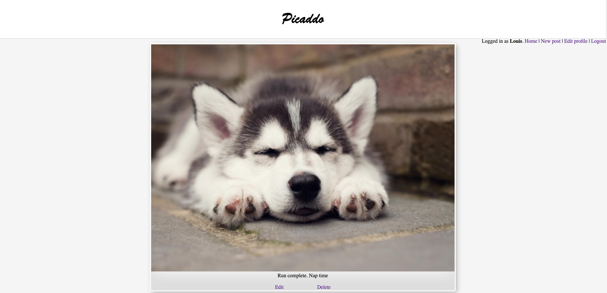

# Picaddo

Weekend challenge for week 8 of Makers Academy - create an Instagram clone using Ruby on Rails

* Versions
  * Ruby 2.6.3
  * Rails 6.0.3

* System Dependencies
  * Rspec, faker, factoryBot and capybara for testing
  * Haml
  * Devise for user registration and session control
  * PostgreSQL
  * Active Storage

## Installation
    git clone https://github.com/TheDancingClown/Pablo-Picaddo  
    bundle install  
    rails db:create   
    rails db:migrate

## Specifications
* New users can register for an account with a unique email
* Returning users can login
* Unless logged in, users cannot view any posts
* Logged in users can view all posts on a homepage
* Users can click on posts for a larger view and links to edit and delete
* Users can update their profile and delete their account

  

