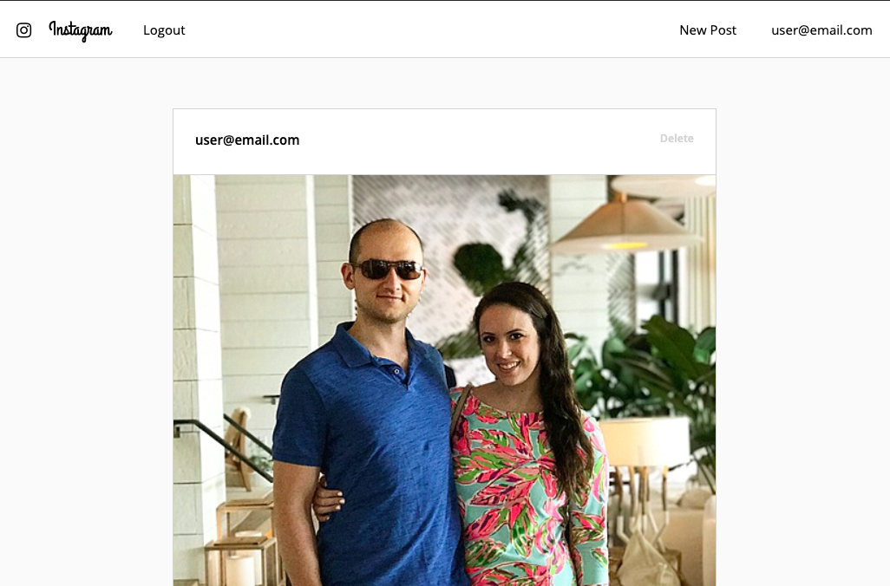
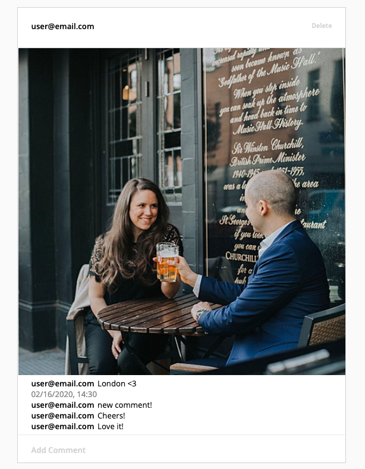
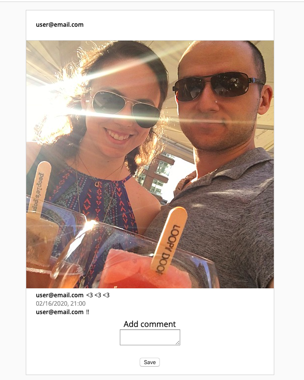
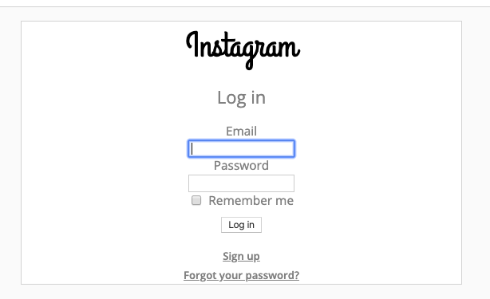

# Instagram Challenge

Build a clone of Instagram using Rails. The program has **users** who can post **pictures**, and write **comments** on pictures.

## Getting Started

```
bundle install
bin/rails db:create
bin/rails db:migrate
```

### Active Storage Image Processing
If you do not already have ImageMagick installed, run:

```brew install imagemagick```

## Running the program

### Start Server

```sh
$ rails server
```

### View in Browser

```
localhost:3000
```

## Running the tests

To run tests for this program, run:

```
$ bundle exec rspec
```

## Built With

* Ruby
* Rails
* Devise (for user authentication)
* Rspec (for testing)
* Capybara (for testing)

## Design Examples
### Posts Page


### Full Post


### Add Comment


### Log In


## User Stories

```

As a User
So that I can show people what I am doing  
I want to post a picture to Instagram

As a User
So that I can see what others are doing  
I want to see posts from other people

As a User
So that I can post to Instagram as me
I want to sign up for Instagram

As a User
So that only I can post pictures on Instagram as me
I want to log in to Instagram

As a User
So that I can avoid others posting on Instagram as me
I want to log out of Instagram

As a User
So that I can change my mind on what I show on Instagram
I want to be able to edit and delete my own posts

As a User
So I can interact with others on Instagram
I want to write comments on posts

```

===================

## Instructions

* Feel free to use Google, your notes, books, etc., but work on your own
* If you refer to the solution of another coach or student, please put a link to that in your README
* If you have a partial solution, **still check in a partial solution**
* You must submit a pull request to this repo with your code by 9am Monday morning

## Task

Build Instagram: Simple huh!

Your challenge is to build Instagram using Rails. You'll need **users** who can post **pictures**, write **comments** on pictures and **like** a picture. Style it like Instagram's website (or more awesome).

Bonus if you can add filters!

## How to start

1. Produce some stories, break them down into tasks, and estimate
2. Fork this repo, clone, etc
3. Initialize a new rails project

Remember to proceed in small steps! Getting confused? Make the steps even smaller.

## Code Quality

For linting, you can use the `.rubocop.yml` in this repository (or your own!).
You'll need these gems:

```ruby
gem "rubocop", "0.79.0", require: false
gem "rubocop-rails"
```

You can also lint Javascript, CSS, and ERB — feel free to research this. These
will help you to train yourself to produce cleaner code — and will often alert
you to mistakes or mishaps!

