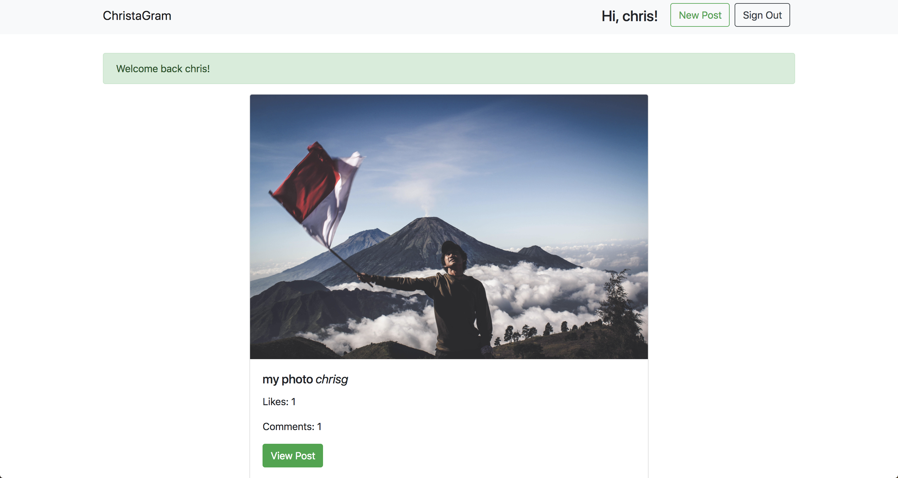
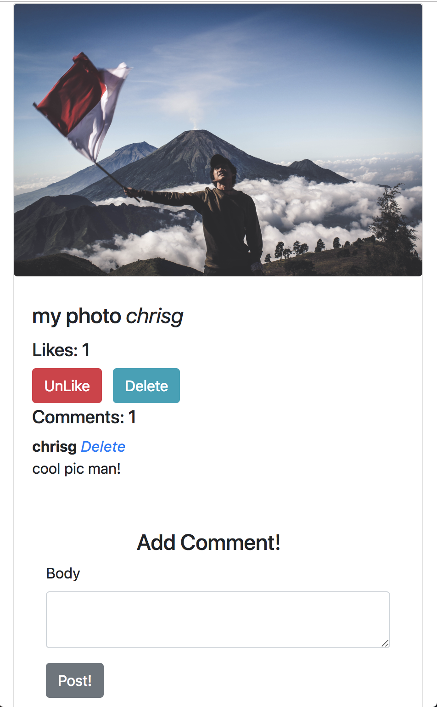

# ChristaGram


[](https://coveralls.io/github/chrisjgilbert/instagram-challenge?branch=master)

[An Instagram clone made with Rails deployed on Heroku](https://quiet-spire-51096.herokuapp.com/)

## How to use   
* `git clone https://github.com/chrisjgilbert/instagram-challenge`   
* `bundle` to install dependencies   
* `rails s` to fire up the server on http://localhost:3000/    

### Local db setup   
* [Follow these instructions if you need to install Postgres](https://gist.github.com/ibraheem4/ce5ccd3e4d7a65589ce84f2a3b7c23a3)  
* `bin/rails db:create`   
* `bin/rails db:migrate`   

### Run tests   
* `bundle exec rspec`   

### View test coverage   
* `open coverage/index.html`   

### Run rubocop   
* `rubocop`   

### To clean local database use   
```
> bin/rails db:drop
> bin/rails db:create
> bin/rails db:migrate
```

## Desktop View


## Mobile View

