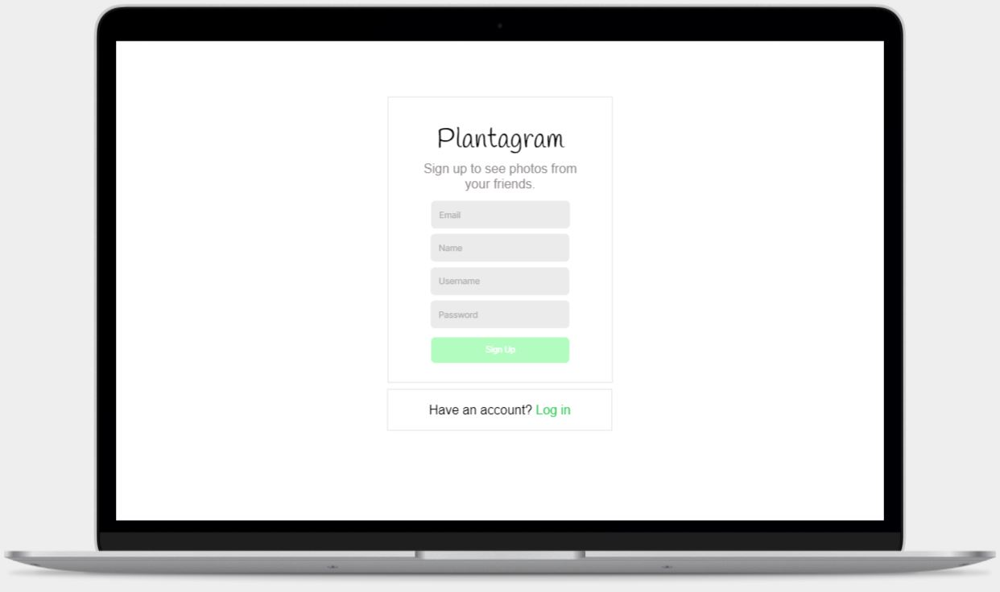
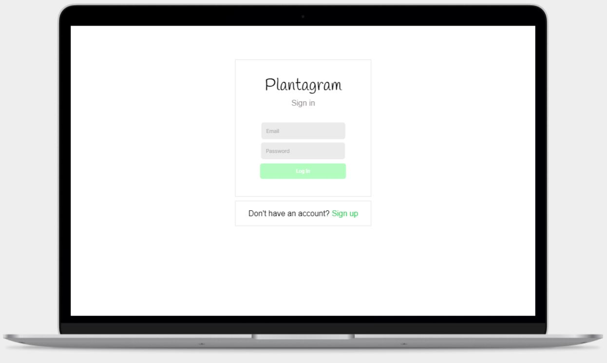
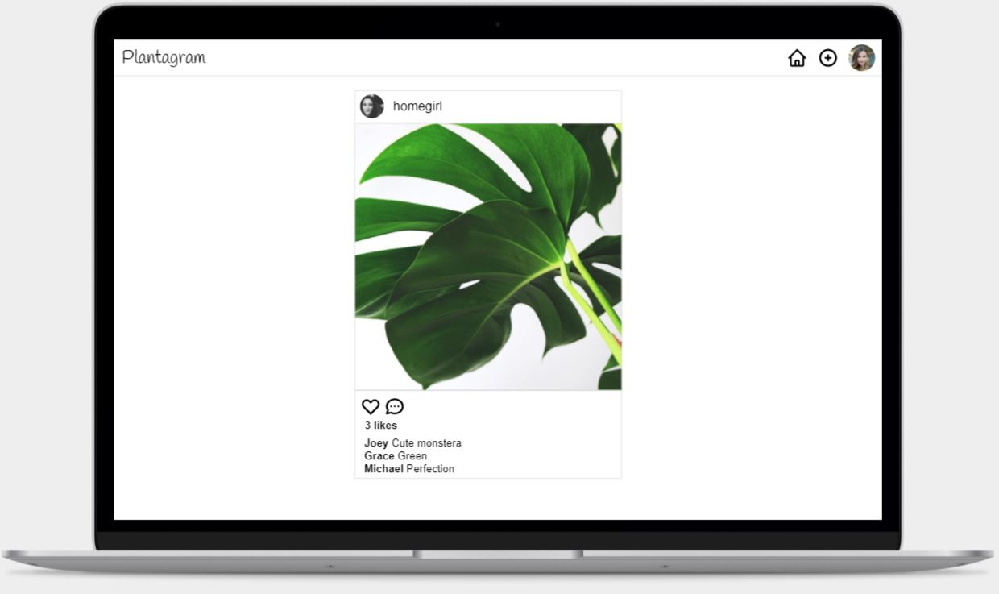

Instagram Challenge
===================

## Instructions

* Feel free to use Google, your notes, books, etc., but work on your own
* If you refer to the solution of another coach or student, please put a link to that in your README
* If you have a partial solution, **still check in a partial solution**
* You must submit a pull request to this repo with your code by 9am Monday morning

## Task

Build Instagram: Simple huh!

Your challenge is to build Instagram using Rails. You'll need **users** who can post **pictures**, write **comments** on pictures and **like** a picture. Style it like Instagram's website (or more awesome).

Bonus if you can add filters!

## How to start

1. Produce some stories, break them down into tasks, and estimate
2. Fork this repo, clone, etc
3. Initialize a new rails project

Remember to proceed in small steps! Getting confused? Make the steps even smaller.

## Code Quality

For linting, you can use the `.rubocop.yml` in this repository (or your own!).
You'll need these gems:

```ruby
gem "rubocop", "0.79.0", require: false
gem "rubocop-rails"
```

You can also lint Javascript, CSS, and ERB — feel free to research this. These
will help you to train yourself to produce cleaner code — and will often alert
you to mistakes or mishaps!

# My Solution

🚧 Work in progress 🚧

## How to Use

First, clone this repository, then:

```bash
> bundle update
> bundle install
> bin/rails db:create
> bin/rails db:migrate

> bundle exec rspec # Run the tests
> bin/rails server # Start the server at localhost:3000
```

## User Stories

```
As a User,
So that I can share my pictures online,
I'd like to be able to post pictures.
```

```
As a User,
So that I can change my pictures,
I'd like to be able to delete pictures.
```

```
As a User,
So that I can see a feed of pictures,
I'd like to be able to view a page of pictures.
```

```
As a User,
So that I can share my thoughts, 
I'd like to be able to write comments on pictures.
```

```
As a User,
So that I can appreciate pictures,
I'd like to be able to *like* a picture.
```

```
As a User,
So that my username is associated with my pictures,
I'd like to be able to sign up with my email address.
```

```
As a User,
So that I can keep my account secure,
I'd like to be able to sign in with my email and password.
```

```
As a User, 
So that I can keep my account secure,
I'd like to be able to sign out.
```

```
As a User,
So that I can enjoy my time on the site,
I'd like to be able to see an aesthetically pleasing app.
```

## Mock Ups

I imagined what the design would look like (and also imagine that I had the CSS skills to do this...)

Sign Up:



Sign In:



Feed:



## Design Palette
```
logo font family: Handlee (Google Fonts)

background color: #fafafa
border color (1px): #dbdbdb

button color: #b2fcc0
button color (hover): #38cc5d
button font family: Arial
button text color: white

text font family: Arial
text: black
text (muted): #928e8e

hyperlinks color: #38cc5d
hyperlinks color (visited): #38cc5d

icons: Tailwind heroicons
color: black
home page: HomeOutline
new post: PlusCircleOutline
like: HeartOutline
comment: ChatOutline
```

## Approach
* Created user stories to capture, define and communicate the requirements.
* Created mock ups using <a href="http://www.framer.com">framer</a> to get a basic idea of what I want the site to look like, what colours and fonts I wanted to use. Please see 'Design Palette' above for the draft.
* Once I set up my Rails project, I initialised RSpec, Database Cleaner, Rubocop, and then decided to deploy the new Rails application early in order to avoid integration problems later.
* Created User Model with validations
* Added Sign Up, Sign In, Sign Out features. 
* Used Bootstrap to aid layout
* Used branches to separate topic branches.
* Used `rails generate scaffold` to create Post.
* Posts are in reverse chronological order.
🚧 Work in progress 🚧

## Heroku

🚧 <a href="https://cynthia-plantagram.herokuapp.com/">Cynthia Plantagram</a> 🚧 

## TODO
* Routes: 
  * '/' should redirect to sign up if not logged in, otherwise it should redirect to display all posts.
  * Tidy up - use named routes.
* Layout: 
  * Heroicons: `gem 'rails_heroicons', '~> 0.6.0'`
  * Posts: each post should look like mock up.
  * Sign in/Sign up: main content should be inside a box centered in  the page. 
  * About: should be boxed.
  * Lots of other improvements too long to list! 
* Posts: 
  * New posts form should validate the file extension `%w(jpg jpeg gif png)`. 
  * Image uploads should be resized to be square.
* Heroku: 
  * Load some content: plant images from Unsplash.
* Features:
  * Users should be able to comment/like pictures.
  * Remove edit feature from post - only allow comment to be changed
  * When submitting a new post, the user should not have to fill in their own user id.
  * Posts: each post should look like mock up.
  * Posts: infinite scroll.
  * Sign up: should have a link to sign in. 

