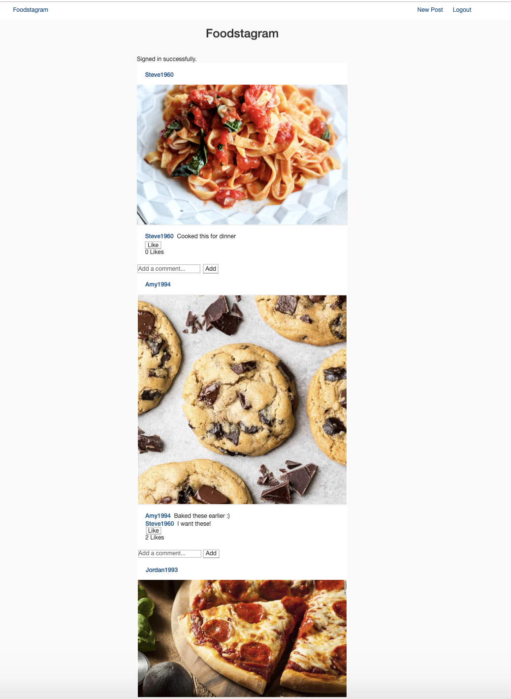
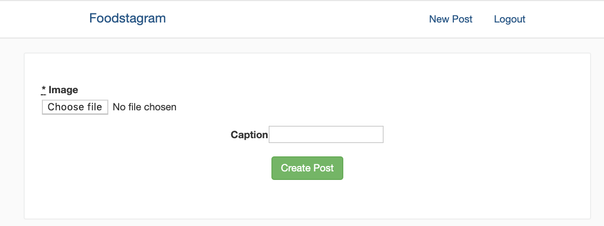

Instagram Challenge
===================

[](https://travis-ci.org/jordantroberts/instagram)[](https://codecov.io/gh/jordantroberts/instagram)


Week 8 weekend challenge: build an Instagram clone using Rails.

## Installing this app
1. Clone this repo
2. Run `bundle install` from the command line
3. Run `bin/rails db:create` and then `bin/rails db:migrate` from the command line

## Testing this app
Run `bundle exec rspec` from the command line

## Using this app
Run `bin/rails server` and visit http://localhost:3000

## User Stories

```
As a hungry person
So that I can drool over pictures of delicious food
I would like to sign up for an account on Foodstagram.

As a user
So that I only need to sign up once
I would like to be able to login to my existing account.

As a foodie
So that I can share pictures of my own meals
I would like to be able to post a picture to Foodstagram.

As a user
So that I can share my opinions on other people's food pics
I would like to be able to comment on other pictures.

As a user
So that I can share my appreciation for food
I would like to be able to like pictures.
```

## Screenshots

<div align="center">
    
</div>

<div align="center">
    
</div>

## Acknowledgments
- Jordan Roberts
- Makers Academy Challenge
- For help with which gems to use and to get started, I referred to Chapters 1 and 2 of <a href="https://github.com/benwalks/Lets-Build-Instagram-Free-Book">this</a> tutorial when I got stuck.
