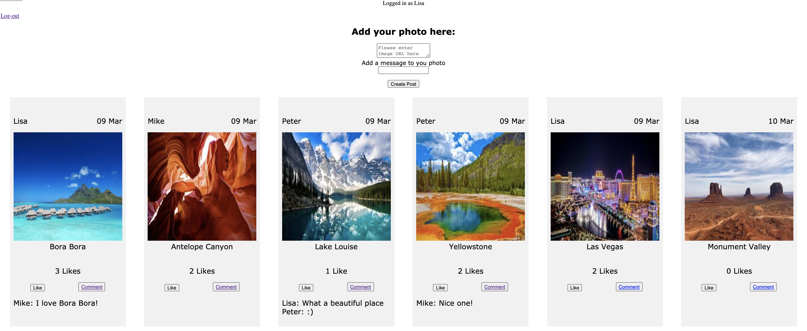

Instagram Challenge
===================

Build Instagram

Your challenge is to build Instagram using Rails. You'll need **users** who can post **pictures**, write **comments** on pictures and **like** a picture. Style it like Instagram's website (or more awesome).


## How to run 

Clone this repo

```
 git clone https://github.com/lisabardelli/instagram_challenge.git
 cd instagram_challenge
 bundle install
 bin/rails db:create
 bin/rails db:migrate
 bin/rails server
```
And then navigate to 'localhost:3000' in your browser

## **Home**

