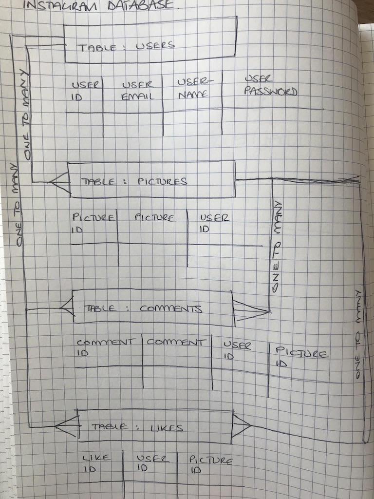

RACHEL GRIFFITHS
=================

## CHALLENGE: INSTAGRAM
------------

##### BUSINESS LOGIC
------------
* USERS can post PICTURES
* USERS can write COMMENTS on pictures
* USERS can LIKE pictures

##### WEB INTERFACE
* Style it like Instagram's website (or more awesome!)
* [Instagram Official] (https://www.instagram.com)

### TECHNOLOGIES
------------
* Ruby On Rails - Web Application Framework

### GETTING STARTED
------------
* Clone the following repo: git@github.com:rachjgriff/instagram-challenge.git
* Run the following in your command line:

```bash
> bundle install
> bin/rails db:create
> bin/rails db:migrate

> bundle exec rspec # Run the tests to ensure it works
> bin/rails server # Start the server at localhost:3000
```

### TESTING
------------
* RSpec - Testing Framework
* Rubocop - Linter
* SimpleCov - Test Coverage
* Travis - CI

### APPROACH
------------
1. Setup project file with required frameworks  

2. Breakdown business logic provided into web   requirements

3. Diagram instagram database:



### WEB REQUIREMENTS
------------
##### USERS
- [ ] User can sign up with username, email address and password
- [ ] User can sign in
- [ ] User can sign out
- [ ] User details are stored in a database
- [ ] User is redirected to sign up/sign in page if not logged in

  ###### CONFIRMATION
  - [ ] User receives confirmation via webpage if successfully signed up
  - [ ] User receives confirmation via webpage if successfully signed in

  ###### SIGN UP FEEDBACK
  - [ ] User receives feedback via webpage if sign up is unsuccessful due to invalid email
  - [ ] User receives feedback via webpage if sign up is unsuccessful due to email already being taken
  - [ ] User receives feedback via webpage if sign up is unsuccessful due to password criteria not met
  - [ ] User receives feedback via webpage if sign up is unsuccessful due to password not matching password confirmation

  ###### SIGN IN FEEDBACK
  - [ ] User receives feedback via webpage if sign in is unsuccessful due to invalid email
  - [ ] User receives feedback via webpage if sign in is unsuccessful due to email not being recognised
  - [ ] User receives feedback via webpage if sign up is unsuccessful due to email and password combination is incorrect

##### PICTURES
- [ ] User can upload picture
- [ ] User can delete picture
- [ ] Pictures are stored in a datatbase against the user id (one-to-many relationship)
- [ ] Pictures are displayed on a web page with the user's username against it

##### COMMENTS
- [ ] User can leave a comment against a picture
- [ ] User can delete a comment
- [ ] Pictures can have multiple comments against them from different users or the same user
- [ ] Comments are stored in a database (one-to-many relationship)

##### LIKES
- [ ] User can 'like' a picture
- [ ] User can 'unlike' a picture
- [ ] Pictures can have multiple 'likes' against them from different users
- [ ] Likes are stored in a database (one-to-many relationship)


------------
Instagram Challenge
===================

## Instructions

* Challenge time: one weekend
* Feel free to use Google, your notes, books, etc., but work on your own
* If you refer to the solution of another coach or student, please put a link to that in your README
* If you have a partial solution, **still check in a partial solution**
* You must submit a pull request to this repo with your code by 9am Monday morning

## Task

Build Instagram: Simple huh!

Your challenge is to build Instagram using Rails. You'll need **users** who can post **pictures**, write **comments** on pictures and **like** a picture. Style it like Instagram's website (or more awesome).

Bonus if you can add filters!

## How to start

1. Produce some stories, break them down into tasks, and estimate
2. Fork this repo, clone, etc
3. Initialize a new rails project

Remember to proceed in small steps! Getting confused? Make the steps even smaller.

## Code Quality

For linting, you can use the `.rubocop.yml` in this repository (or your own!).
You'll need these gems:

```ruby
gem "rubocop", "0.48.1"
gem "rubocop-rails"
```

You can also lint Javascript, CSS, and ERB — feel free to research this. These
will help you to train yourself to produce cleaner code — and will often alert
you to mistakes or mishaps!
