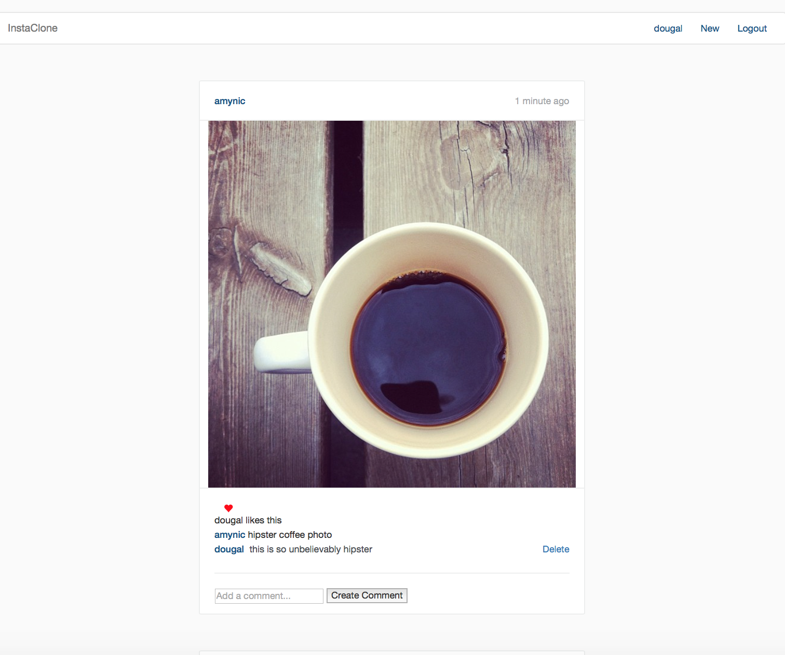

[](https://travis-ci.org/missamynicholson/instagram-challenge)

Instagram Challenge
===================

About
-------
This is the Ronin Wk7 Weekend Challenge which involved making a simple Instagram clone using Rails.
The instructions can be found [here](https://github.com/makersacademy/instagram-challenge).


User Stories
-----
```
As a user,
So that I can see what other people are up to,
I want to view posts on the homepage.

As a user,
So that I can show what I'm up to,
I want to add a post to the homepage.

As an indecisive user,
So that I can change what I show,
I want to be able to update my post.

As a careless user,
So that I can remove an accidental post,
I want to delete a post I have created.

As a competitive user,
So that I can see how popular I am,
I want to view the likes my post receives.

As an admiring user,
So that I can reward a good post,
I want to like a post.

As an indecisive user,
So that I can change my opinion on a post,
I want to be able to unlike a post I have previously liked.

As a vain user,
So that I can have my ego boosted,
I want to receive glowing comments on my posts.

As an opinionated user,
So that I can share my feelings,
I want to comment on a post.

As a careless user,
So that I can remove an accidental comment,
I want to delete a comment I have previously added to a post.

As a concerned user,
So that other people cannot remove my beautiful selfies,
I want other users not to be able to delete posts I create.

As a concerned user,
So that other people cannot remove my witty remarks,
I want other users not to be able to delete comments I write.
```

Installation
-----

1. Clone this repo
2. run `bundle`
3. run `bin/rake db:migrate`
4. run `bin/rails s`
5. Open `http://localhost:3000` in your browser

Or, you can view the app at [www.insta-clone-amy.herokuapp.com](https://insta-clone-amy.herokuapp.com/).


Screenshot
-----


