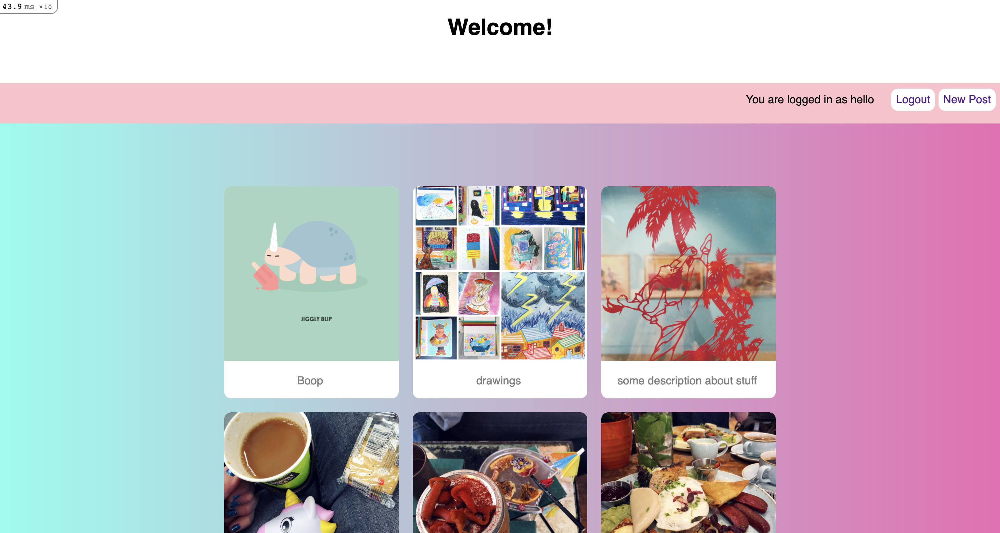

Instagram Challenge
===================

Build Instagram using Rails.

[x] users can can post pictures
[ ] users can write comments on pictures
[ ] users can like a picture
[ ] app is styled

```
1. As a user  
So that I can share my photos with other users  
I want to to post a photo  

2. As a user  
So that I can say something about another users photo  
I want to comment on a photo  

3. As a user  
So that I can let another user know that I like their photo  
I want to like a photo  
```
---


#### set up tasks
[x] initialize Rails  
[x] add rubocop gems for code quality checks  
[x] bundle  

#### setting up a user account
[x] Sign up functionality  
  [x] bcrypt set up  
  [x] Users model (database with username and password)  
  [x] Form for signing up in new users view  
  [x] User controller creates and saves user  
[x] Log in functionality  
  [x] Sessions set up:  
    [x] Form for logging in in new sessions view  
    [x] create sessions with user id  
    [x] renders same page if no user found  
    [x] current_user set by session user id, logged in username on root page  
[x] Logout functionality  
    [x] user clicks logout  
    [x] destroy session  

#### User story 1 tasks
[x] share a photo button or link  
  [x] form for uploading a photo  
  [x] photo shows on the homepage posts feed    


#### User story 2 tasks
TBD  

#### User story 3 tasks
TBD  

---

### Current status and notes of project:

  

- run bin/rails s and visit http://localhost:3000/ for user testing  
- few simple feature tests are failing. Will be the first focus when picking up this project again  
- There is currently no unit testing. Currently not required as no code outside of rails automated functions added  
- set up active storage model but used carrierwave instead. Need to figure out how to remove the migration and files.  


#### resources
* https://levelup.gitconnected.com/simple-authentication-guide-with-ruby-on-rails-16a6255f0be8   
- for the signup/login/logout functionality with authentication and session setting  
* https://github.com/carrierwaveuploader/carrierwave  
- carrierwave for uploading photos  
* https://guides.rubyonrails.org/  
- general rails reference guide  
