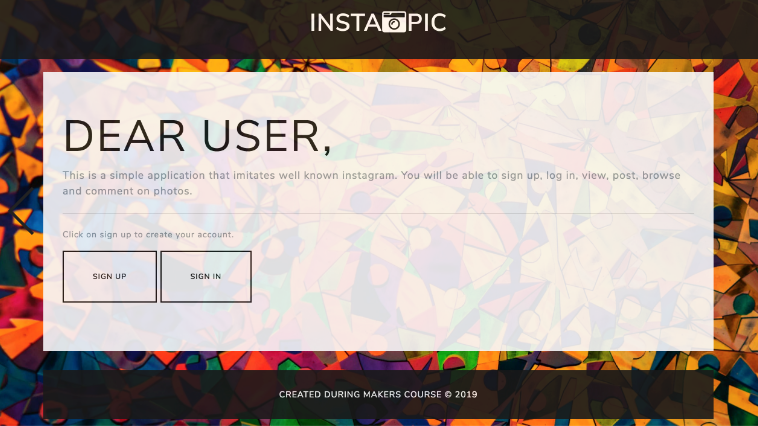
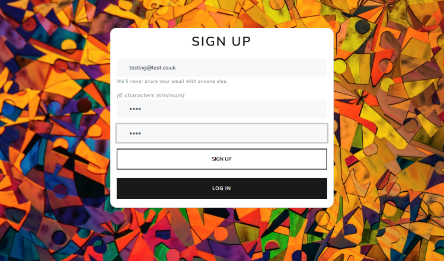
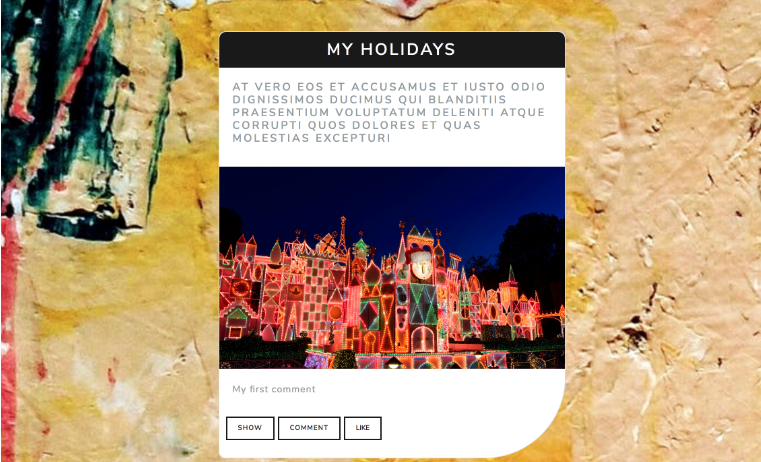

# Instagram Challenge
---------------------

[](https://travis-ci.org/KrzysztofBalejko/instagram-challenge)

[](https://codeclimate.com/github/KrzysztofBalejko/instagram-challenge/maintainability)

[](https://codeclimate.com/github/KrzysztofBalejko/instagram-challenge/test_coverage)

[](https://forthebadge.com)

-------------------------

## Quickstart

Application deployed to [Heroku](https://app-like-instagram.herokuapp.com/)

**If you want to run application on your local server, please clone this repository and follow below instructions.**

```
git clone https://github.com/KrzysztofBalejko/instagram-challenge.git
```
**Instructions:**
```
> bundle install
> bin/rails db:create
> bin/rails db:migrate

> bundle exec rspec # Run the tests to ensure it works
> bin/rails server # Start the server at localhost:3000
```

## Technology used, back to front:

* Ruby on rails
* PostgreSQL
* Travis CI
* Rubocop / Simplecov
* RSpec / Capybara

* CSS
* Bootstrap / Bootswatch
* Font awesome

## My user stories:
```
As a user,
So I can use a service
I want to be able to sign up
```
```
As a user,
So I can access my account,
I want to be able to sign in
```
```
As a user,
So I can see the site content,
I want to see the pictures
```
```
As a user,
So I can use the service properly,
I want to be able to add a picture
```
```
As a user,
So I can express myself,
I want to comment on picture
```
# Screenshots:

**Home page**



**Registration page**



**Photos page**


