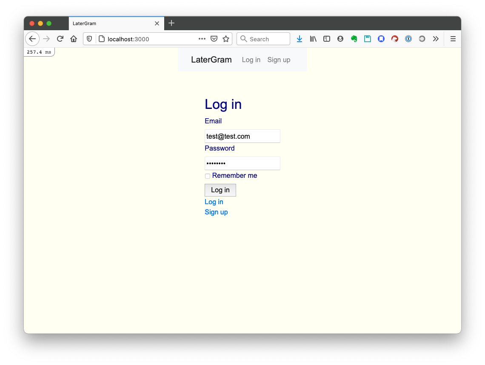
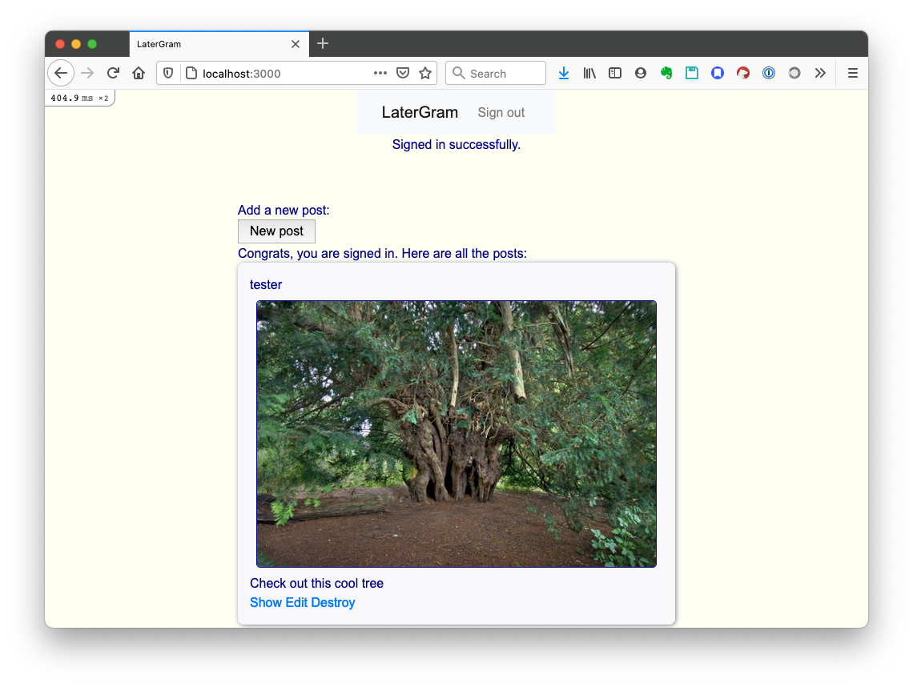
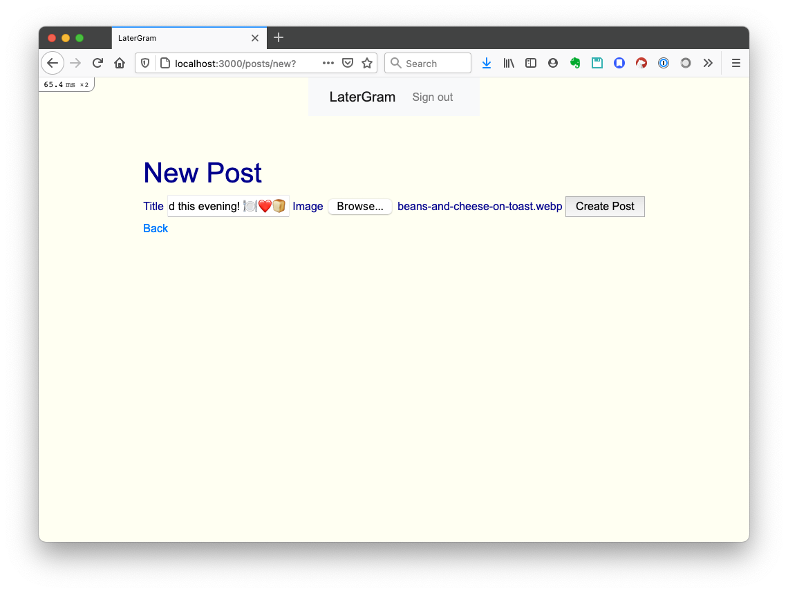
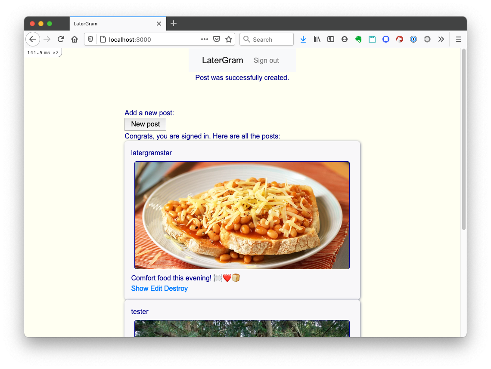

## LaterGram

An Instagram clone, built in Rails.

[Description](#description)  
[Installation and Usage](#installation-and-usage)  
[Known Issues](#known-issues)  

### Description
This was the final weekend challenge for the [Makers Academy](https://makers.tech) coding bootcamp. The goal was to practise Rails, as we were working on our Rails [group project](https://github.com/mscwilson/acebook-poke) at the time.

I used [Devise](https://github.com/heartcombo/devise) to manage user authentication. That includes password encryption. I used Bootstrap for the navbar at the top.  

Tests are written in Rspec with Capybara for feature testing.  

The standard Rails database is SQLite, but I chose to use PostgreSQL to allow deployment to Heroku. Try out LaterGram [here](https://latergram-82272.herokuapp.com/).  

The app looks like this:  
<figure style="margin: auto">
<figcaption>Arriving at the homepage. Can't see any posts.</figcaption>

</figure> 

<figure style="margin: auto">
<figcaption>The homepage once a user has logged in. Now all posts are visible.</figcaption>

</figure> 

<figure style="margin: auto">
<figcaption>Making a new post.</figcaption>

</figure> 

<figure style="margin: auto">
<figcaption>The new post is displayed on the homepage.</figcaption>

</figure> 
  
### Installation and Usage  
You will need Ruby 3.0.0 installed, and Bundler
* Clone this repo
* Navigate into cloned folder
* Install the dependencies: `bundle`
  
* Create the databases: `rails db:create`
* Create the tables in the databases: `rails db:schema:load`
  
* Run the app locally: `rails server`
* Go to `localhost:3000` in your browser to try out the app

* To run tests: `rspec`
* If there is an error `Webpacker::Manifest::MissingEntryError`, install Webpacker with `bundle exec rake webpacker:install`

### Known Issues
* The navbar doesn't work on mobile.
* 
