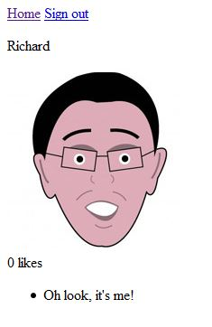

Instagram Challenge
===================

Task
-----

Build Instagram: Simple huh!

Your challenge is to build Instagram using Rails. You'll need **users** who can post **pictures**, write **comments** on pictures and **like** a picture. Style it like Instagram's website (or more awesome).

Bonus if you can add filters!

Progress
--------
Users can upload images, give them a title, edit or delete them, comment on their own and other images.
Like button included but not currently functioning.
No styling added yet.