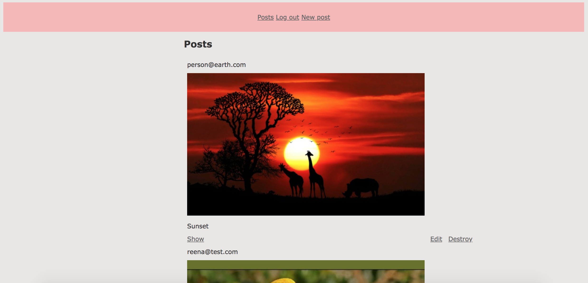

## Instagram Challenge

Makers Academy weekend challenge to build Instagram clone
* Visit the site on "https://reenz-instagram.herokuapp.com/"

## Posts page



## How to use
```
- Clone it (command line - git clone git@github.com:reenz/instagram-challenge.git)
- Install dependencies (command line - bundle install)
- Migrate database (command line - rails db:migrate RAILS_ENV=development)
- Run the server (command line - rails s )
- Visit the app on localhost:3000
```
## Technologies Used
```
- Rails
- Carrierwave
- Mini_magick
- Rspec/Capybara
- PostgreSQL
```
