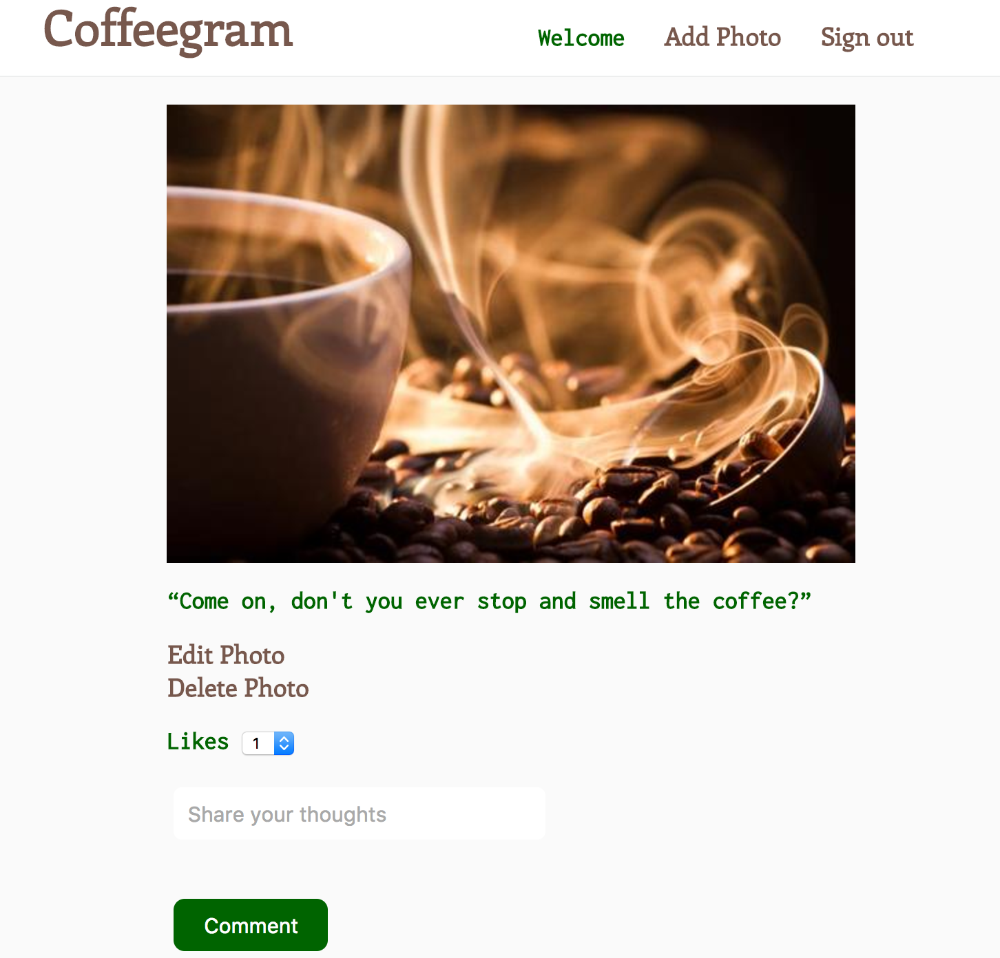
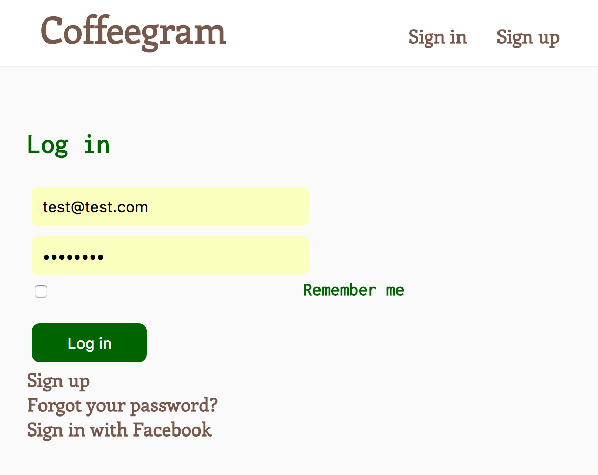

Coffeegram               [](https://travis-ci.org/edytawrobel/instagram-challenge)
===================

 an Instagram clone that provides a platform for users to post and comment on photos of their favourite coffee places

 Available at:
 -----
 https://coffeegrambyedyta.herokuapp.com/


Features :star2:
--------------
* Post a photo with a status;
* User can edit the status or delete their photo;
* User can comment on a photo;
* User can like a photo.

Interface
-----------




User Stories
-----

```
As a visitor
So that I can use the services other than seeing all recently uploaded images,
I want to be able to sign up for the Coffeegram account

As a coffee lover
So that I can share my favourite coffee places with others
I want to be able to upload my pictures

As a coffee lover
So that I can share my feelings about each place,
I want to be able to add a description to a picture

As a coffee lover
So that I can show my enjoyment to the user who posted it
I want to be able to like a picture

As a coffee lover
So that I can express my opinion,
I want to be able to comment on other users' pictures

As a coffee lover
So that I other users' can share their opinion,
I want to be able to receive their feedback in a form of comments

```

Further advancements
-----

```

As a time-pressed user
So that I can avoid typing up my password yet again
I want to be able to login with Facebook account

As a coffee and beauty lover
So that other feel amazing while visiting my website
I want to be able to style it beautifully

As a coffee lover
So that I can see most popular places
I want to see the number of likes each picture receives
```

How to use Coffeegram :page_with_curl:
-------------------------------------

To install and use locally:
```
$ git clone git@github.com:edytawrobel/instagram-challenge.git
$ cd instagram-challenge
$ bundle
$ rake db:create
$ rake db:migrate
$ rails s
```
Then open your browser, visit `http://localhost:3000`.

Testing :white_check_mark:
---------
This project is test-driven with RSpec-Capybara. To run all the tests, simply run `rspec` in your terminal.

Tools used
-----------
* Ruby on Rails
* RSpec-Capybara
* Active Record
* Devise
* Paperclip
* Factory Girl
* AWS S3
