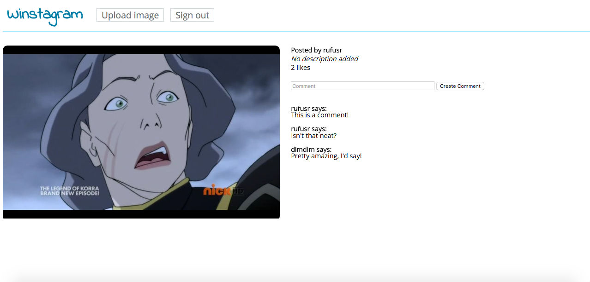

Winstagram
===================
Makers Academy week 07 weekend challenge<br>
Rufus Raghunath<br>


Task
-----

Build an Instagram clone using Rails. The functionality should be based on **users** who can post **pictures**, write **comments** on pictures and **like** a picture.


How to use
-----

- clone this repo
- ```bundle install``` dependencies
- visit ```localhost:3000``` in your browser
- maker a Winstagram account by clicking 'Sign up'
- you can post pictures with descriptions by clicking 'Upload image'
- you can view a larger version of existing images by clicking on its thumbnail on the index page. There you can post likes and comments on the picture.


Screenshots
-----




To do
-----

- implement Facebook login via OAuth
- implement AJAX for likes and comments
- validate user login at model level for creation of images, comments, and likes
- shift data storage to Amazon Web Services


User stories
-----

```
As a visitor,
So I can see what Winstagram has to offer,
I would like to be able to browse recent images.
```
```
As a user,
So that I can start sharing pictures,
I would like to sign up with my email, user handle, and password.
```
```
As a user,
For extra convenience,
I would like to sign up for Winstagram with my Facebook account.
```
```
As a user,
So I can share a picture with the world,
I would like to be able to upload images to Winstagram.
```
```
As a user,
So I can provide context to my posts,
I would like to add descriptions to images when posting.
```
```
As a user,
So I can show my reaction to Winstagram images,
I would like to comment on other users' comments.
```
```
As a user,
So I can show my appreciation for good posts,
I would like to be able to 'like' images.
```
```
As a user,
So I can have a smoother WWinstagram experience,
I would like my comments and likes to be posted without a page refresh.
```
```
As an administrator,
So I can ensure the integrity of my system,
I don't want visitors without user accounts to post images, comments, or likes.
```
