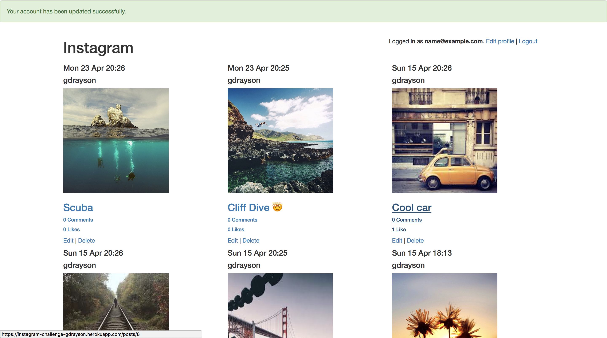
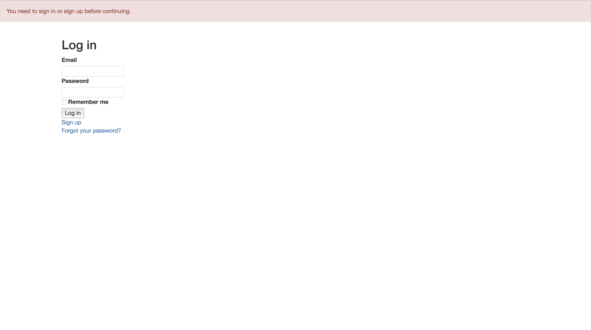

Instagram Clone
===================
[](https://codeclimate.com/github/GeorgeDrayson/instagram-challenge/maintainability)

[](https://codeclimate.com/github/GeorgeDrayson/instagram-challenge/test_coverage)

## Description
The challenge was to build an Instagram clone using Ruby on Rails as part of the Makers Academy course.

## Get started

You can find the app on [Heroku](https://instagram-challenge-gdrayson.herokuapp.com).

Alternatively:
1. Clone the repository
2. Then, run:
```bash
> bundle install
> bin/rails db:create
> bin/rails db:migrate

> bin/rails server
```
## Running the tests
```
rspec
```
Code coverage:
In the rspec you should get a value for the coverage. To get a more detailed analysis of the coverage, go into the coverage file:
```
cd coverage
```
Then:
```
open index.html
```
## Usage
Simply sign up for an account and get posting.





## User stories
```
As a user,
So that I can share my photos,
I want to post pictures

As a user,
So that I can be identified as me,
I would like to have an account

As a user,
So that I can create an account,
I would like to sign up

As a user,
So that I can tell other users what I think of their photos,
I would like to comment

As a user,
So that I can tell other users what I think of their photos,
I would like to like a picture

As a user,
So that my posts can be identified as mine,
I would like them to show my username

As a user,
So that I can change my photo or description,
I would like to edit

As a user,
So that I can delete my post,
I would like to delete

As a user,
So that other users can't delete or edit my posts,
I would like to be the only one that can edit/delete my posts
```
