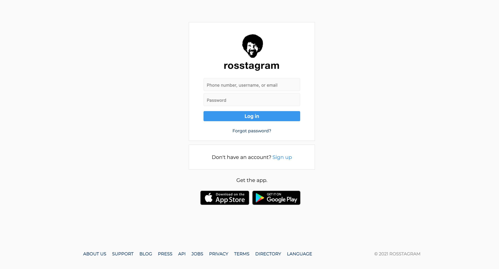
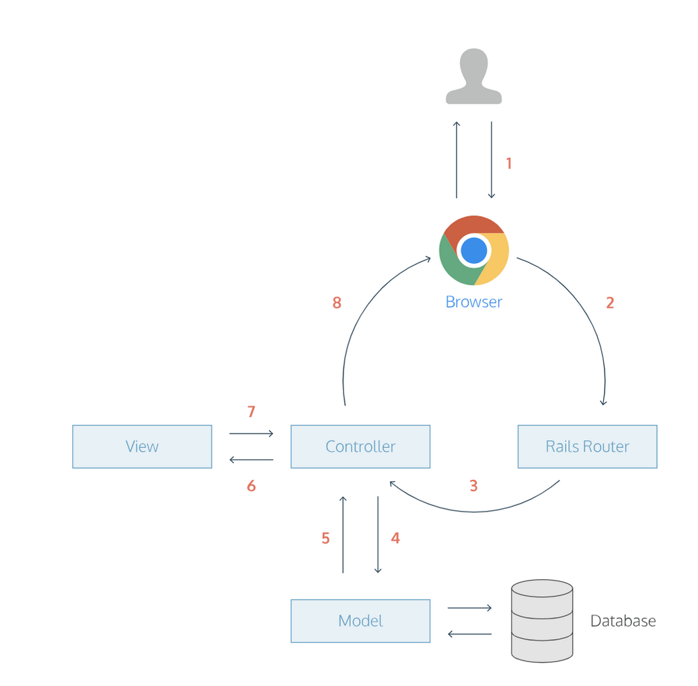

# Instagram Challenge

[](https://www.codefactor.io/repository/github/jasonrowsell/instagram-challenge) [](https://codeclimate.com/github/jasonrowsell/instagram-challenge/maintainability)

**Rosstagram:** A full-stack web app inspired by the functionality of Instagram. The web app allows the user to create an account, sign-in, and post a picture, amongst other functionalities.

The features built in this project are based on a [brief.](brief.md)

## 👀 Live demo

**[Check it out here.](https://evening-eyrie-51491.herokuapp.com/)** This app is in production, features will be implemented as the project progresses.




## 🏁 Getting Started

To get started with the app, clone the repo then install the required gems:

```sh
bundle install --without production
```

Next, migrate the database:

```sh
rails db:migrate
```

Run the test suite to verify that everything is working correctly.

```sh
rspec
```

If the test suite passes, run the app in a local server:

```sh
rails server
```

## Features

- Create an account
- Sign in with created account
- Post a picture to the feed
- View all pictures on the main feed
- View own pictures on the profile feed
- View pictures of the chosen user's profile
- View other user profiles
- Like a user's picture
- Comment on a user's picture
- Remain logged in (remember token)
- Log out

## Built Using

- HTML
- CSS/SASS (Bootstrap)
- JavaScript
- jQuery
- Ruby
- Ruby on Rails
- Capybara / RSpec (TDD)
- PostgreSQL

## Plan

### MVC

MVC (Model - View - Controller) is an architectural pattern implemented in designing and building software applications. Most commonly, MVC is applied to web applications. The Rails application is split into 3 components:

- Models: Active Record is the _M_ in MVC - the layer responsible for representing business data and logic. Active Record facilitates the creation and use of business objects whose data requires persistent storage to a database.
- Views: Action View is the _V_ in MVC - the layer responsible for handling user interface objects and presentation.
- Controllers: Action Controller is the _C_ in the MVC - the layer responsible for communicating between the Model and View, it receives user input and executes commands accordingly.

### Request Response Cycle



- User opens his browser, types in a URL, and presses Enter. When a user presses Enter, the browser makes a request for that URL.
- The request hits the Rails router (config/routes.rb).
- The router maps the URL to the correct controller and action to handle the request.
- The action receives the request, and asks the model to fetch data from the database.
- The model returns a list of data to the controller action.
- The controller action passes the data on to the view.
- The view renders the page as HTML.
- The controller sends the HTML back to the browser. The page loads and the user sees it.
