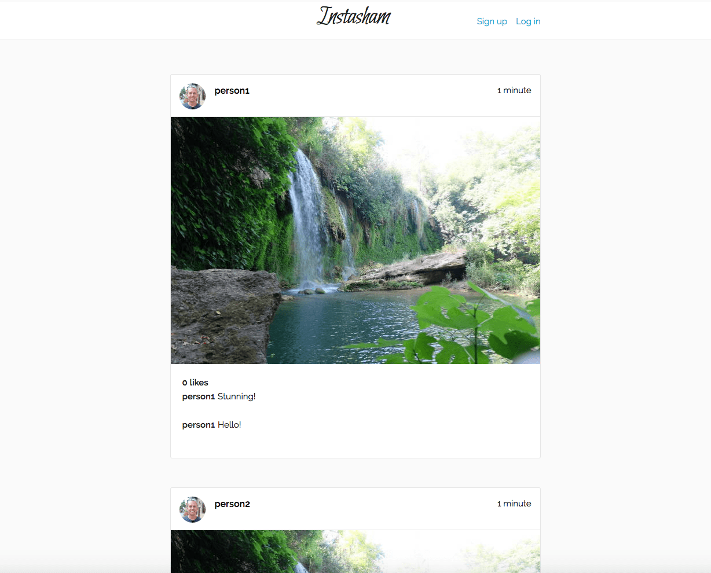
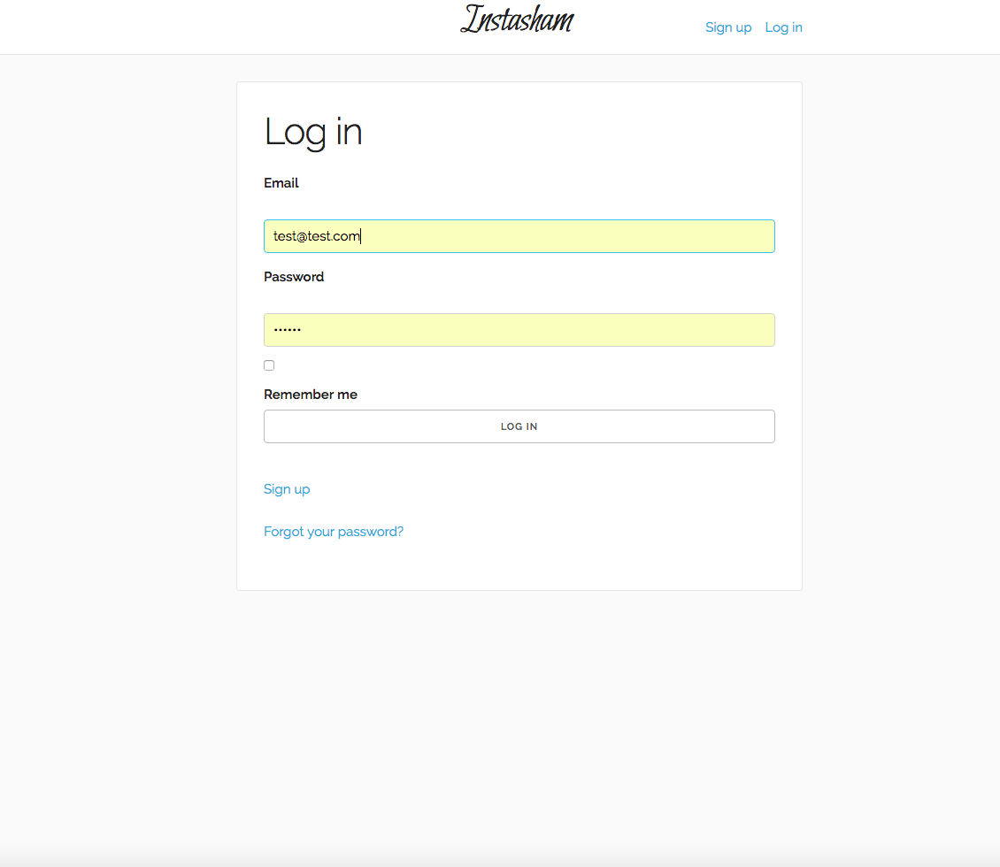
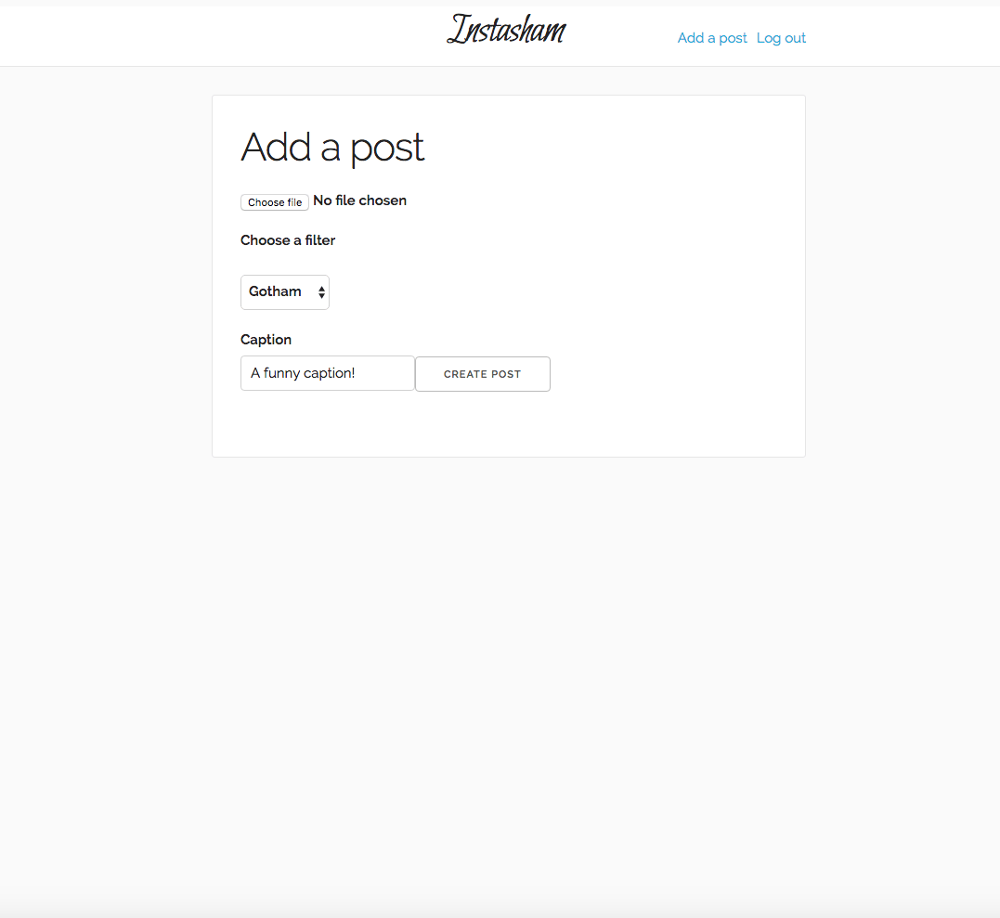

Instagram Challenge
===================

"Instasham" is an Instagram clone built on Rails for the [Makers Academy][http://www.makersacademy.com/ "Makers Academy"] week 8, weekend challenge.

### Implemented User Stories

```
As a user,
So that I can use the site securely
I need to be able to sign up for an account securely

As a user,
So that I can have an online identity
I need to be able to add a profile picture to my account

As a user,
So that nobody else uses my account
I need to be able to sign out of my account

As a user,
So that I can use the site again
I need to be able to sign back in to my account

As a user,
So that I can show my friends what I am eating
I want to be able to post pictures to the website

As a user,
So that I can show my appreciation of a posts
I want to be able to like others' posts

As a user,
So that I interact with my the community
I want to be able to comment on others' posts

As a user,
So that I can make my pictures look funky
I want to be able to apply colour filters to my post's pictures
```

Instructions for use
```
$ git clone https://github.com/treborb/instagram-challenge.git
$ cd instagram-challenge
$ gem install bundler
$ bundle
$ bin/rake db:create
$ bin/rake db:schema:load
$ bin/rails server

visit the page in your browser: http://localhost:3000
```

### [Or view a demo of the app on Heroku][http://robs-instasham.herokuapp.com/]

## Screenshots




