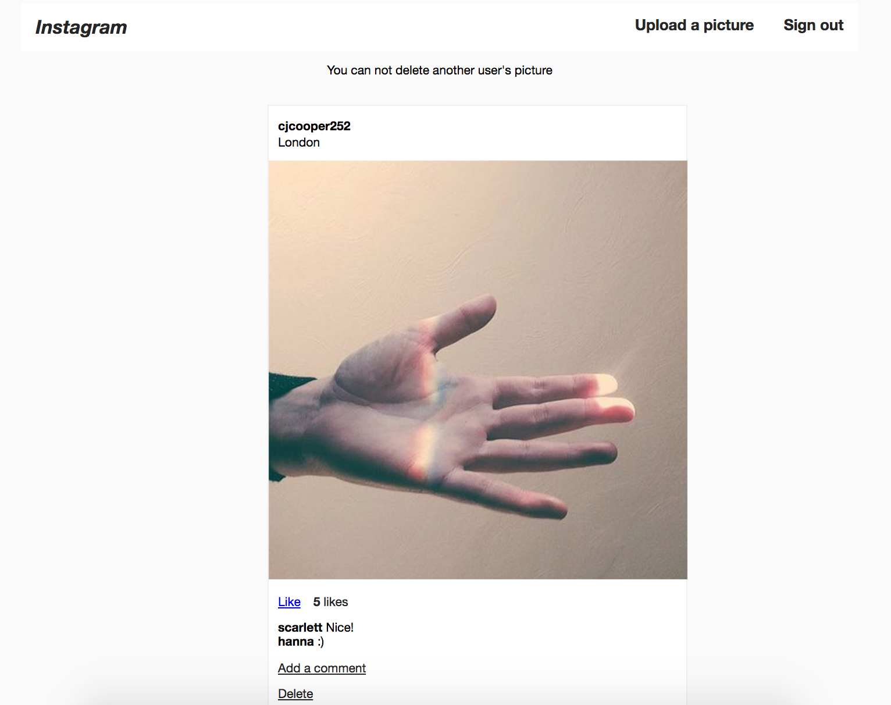

Instagram Clone
=================
This is an Instagram clone built in Rails. It is the week 8 homework challenge at Makers Academy.



Features
----------
* User can sign up
* Post a picture
* Comment on a picture
* Like a picture
* Uses AJAX to update likes without page refresh

Usage
---------
### Run
```
git clone git@github.com:cjcoops/instagram-challenge.git
cd instagram-challenge
rake db:create
rails/bin s
```
Visit http://localhost:3000/

### Test
```
git clone git@github.com:cjcoops/instagram-challenge.git
cd instagram-challenge
rake db:create
rspec
```

Technologies Used
----------

* Rails
* Jquery
* Devise
* Paperclip

#### Testing
* Rspec
* Capybara

Project
----------------
#### Objectives
Objectives objectives objectives

#### Motivations
Objectives objectives objectives

#### Thinking
Objectives objectives objectives

#### Design
Objectives objectives objectives

#### Issues
Objectives objectives objectives

#### Alternatives
Objectives objectives objectives
