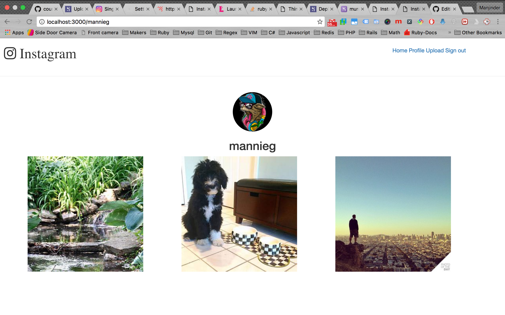
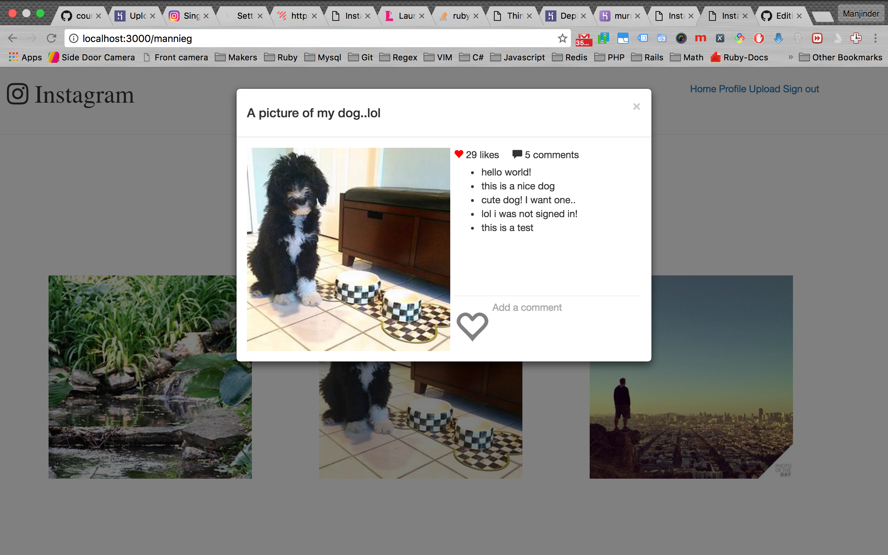

Instagram Clone
===================
A site developed in Ruby on Rails and Javascript.

Demo
-------
https://murmuring-island-90328.herokuapp.com/mannieg

Technologies used
-------
* Ruby
* Ruby on Rails
* Postgres
* RSpec
* Capybara
* Devise
* Paperclip
* Amazon Web Services
* Bootstrap
* Heroku
* Javascript
* AJAX
* Waffle (Managing the project)

Prerequisites
-------
* Rails 4.2.7.1
* Postgres
* ImageMagick
* PhantomJS
* AWS account with S3
* Facebook developer account

Installation Instructions
-------
For testing you will need PhantomJS installed on your OS:
```
brew install phantomjs
```
You will also need to install ImageMagick:
```
brew install imagemagick
```
Run bundle install:
```
bundle install
```
Create the database and run migrations:
```
rake db:create
rake db:migrate
```

Running rails in development mode
-------
After running the below command site should be accessible via your browser: http://localhost:3000 as long as no custom changes have been made.
```
rails s
```

Testing the application
-------
```
rspec
```

## Profile view


## Comment/Like view



## Working on:
* Follows/Unfollow
* Pagination
* Layout improvements
* Search by username
* Autosuggestions on search
