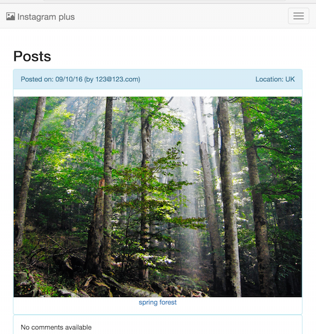
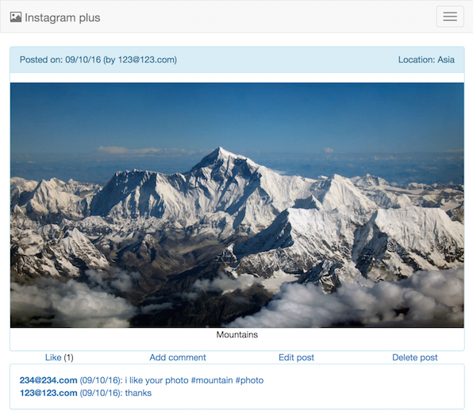
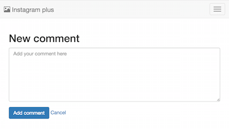

Instagram Challenge
===================

Description:
-------

The program acts as a little Instagram clone that allows the users to post photos to a public stream. It uses Rails and optimized for both PC and mobile devices.

The program covers the following user stories:

```
Put user stories here
```


The program provides the following functions:
------

* User can sign up with their email and password (email is unique);
* User can post a photo with location and a short description. Users can post any number of photos.
* Posts can be commented by users. Users can add any number of comments to posts. A comment can connect to only one post and a post can have any number of comments. Comments can be edited/deleted by the owner.
* Users can like posts. A user can like a post once and the creator of the post cannot like his/her own post.
* The site uses Bootstrap and optimized for mobile users too.
* Login is required for posting/liking/commenting.

### Screenshots of main functions
#### List of posts


#### Post screen


#### Add comment screen


### Instructions for how to run the program

```
$ gem install rails
$ git clone https://github.com/peter-miklos/instagram-challenge
$ bin/rake db:create
$ bundle
$ bin/rails s
```

### Heroku
The program is available on Heroku: https://instagram-plus.herokuapp.com/ (under construction)


Tests
-------
### Feature tests
In feature tests the following test cases have been used:
```
comments
  User logged in
    add comment
      user can add a comment to a post, and notice is shown
      user can add more than 1 comments to a post
    show comment
      user clicks on a comment and the entire content becomes visible
      user can go back to the post and comment is shown there
      message available if there is no comment
    edit comment
      users can edit their own comment, and notice is shown
      users cannot see 'Edit comment' link on comments that are owned by other users
      users cannot edit comments that are not owned by them
    delete comment
      users can delete their own comment, and notice is shown

likes
  User logged in
    like a post
      user can like a post if logged in
      users cannot like their own posts
    unlike a post
      user can unlike a post if logged in and liked it recently
  User logged out
    like a post
      user cannot like a post if logged out

posts
  no post available
    user is informed if no post found
  manage posts
    User logged out
      add post
        user cannot add a post if logged out
      edit post
        user cannot edit a post if logged out
    User logged in
      add post
        user can add post if logged in, and notice is shown
        user cannot add post w/o description
        user cannot add post w/o an image
      show post
        user can see the post on a separate page
        post shows the email of user who created the post
      edit post
        users can edit their own posts, and notice is shown
        users cannot see 'Edit post' link on posts that are owned by other users
        users cannot edit posts that are not owned by them
      delete post
        users can delete their own post, and notice is shown
        users cannot see 'Delete post' link on posts that are owned by other users

user management
  sign up
    signs up successfully
  log in and log out
    user logs in successfully
    user logs out successfully
```
