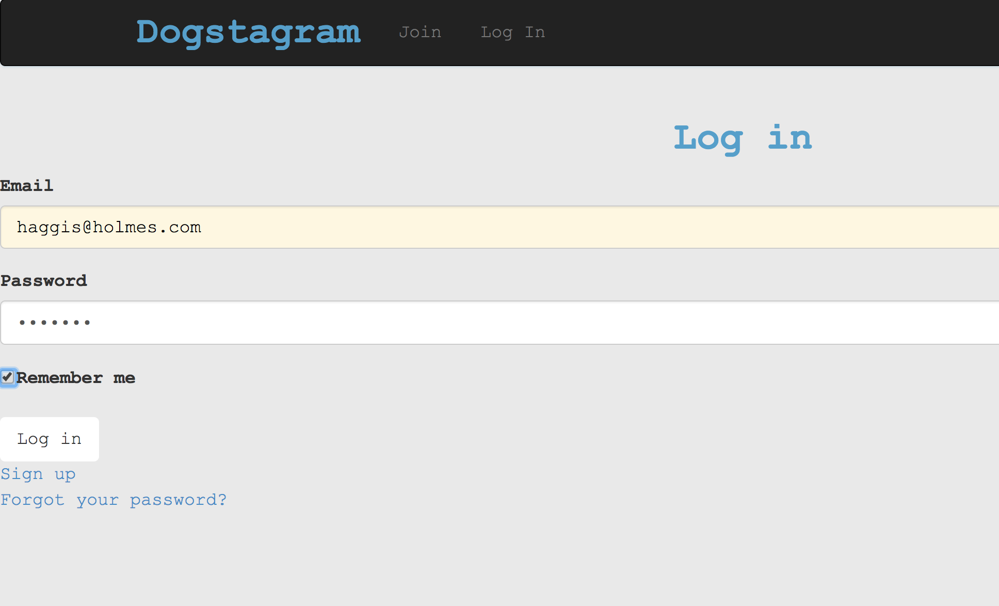
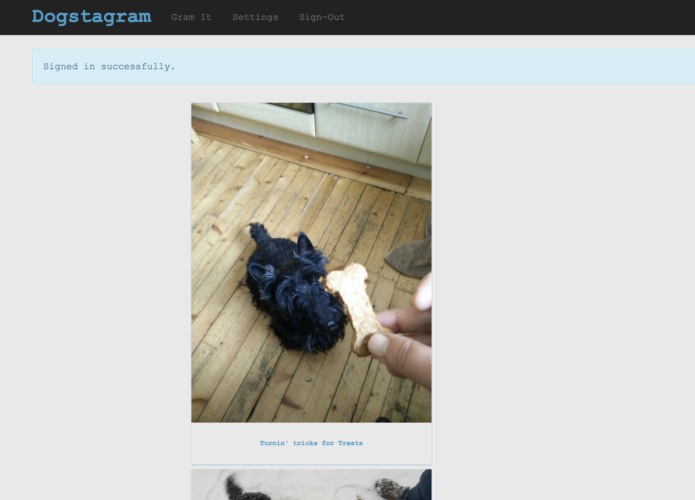
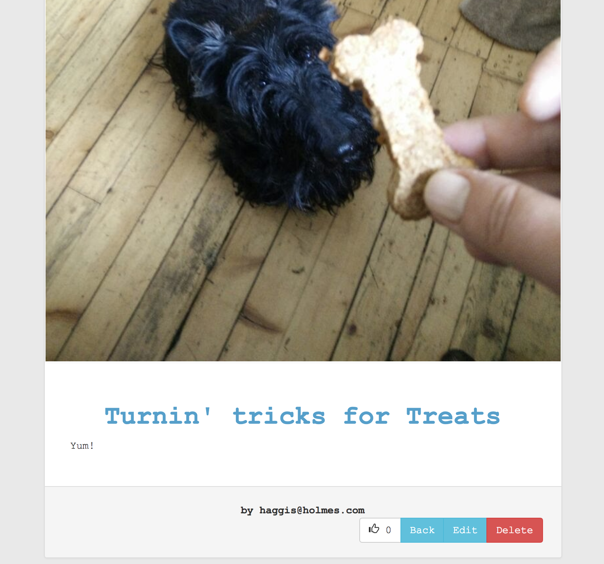

Dogstagram
===================

## Description
* Dogstagram is the latest instagram clone that allows our furry companions to post all of their favourite things. 

## Technologies Used
* [Ruby on rails]()
* [PostgresSQL]()
* [Travis CI]()
* [RSPEC]()
* [Capybara]()

## Getting Started
* `git clone https://github.com/CazaBelle/instagram-challenge.git`
* `cd repo instagram-challenge`
* `rake db:create`
* `rake db:migrate`
* `bin/rails server`
* Navigate to localhost:3000 in your browser
 
### Prerequisites

### Installing

## Testing 

## Demo
* Login

* Homepage

* Picture View

## Deployment

## Built With

## Acknowledgements
* [Conversion of sqlite to pg to allow deployment](https://www.daveferrara1.com/ruby-in-rails-switch-from-sqlite3-to-postgres/)

