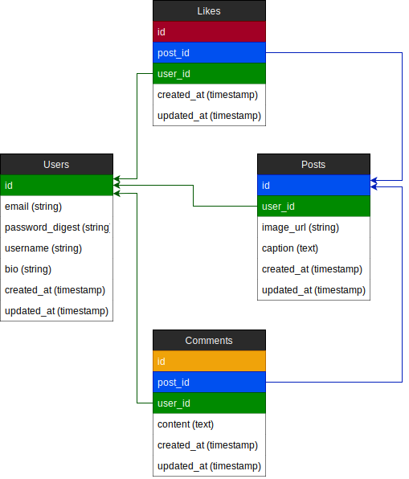

# !! Likes and Comments not yet implemented

Using the app:

```
git clone https://github.com/ConorButler/instagram-challenge.git
cd instagram-challenge
bundle install
npm install
rails s
```

You may need to revert back to an earlier versin of node (16.13).

# User stories:
```
✔ As a User
So that I can share my photo with other people
I want to post it to instagram

✔ As a User
So that I can mark posts as my own
I want to sign up and make posts with my username

✔ As a User
So that no one else can post as me
I want be able to log in with my details and log out when I want

✔ As a User
So that I can see other people's photos and get inspired
I want to see other posts in a feed

As a User
So that I can discuss the photos
I want to comment on posts

As a User
So that I can show that I like a post
I want to be able to click a button to like a post
```

## Domain Model



Instagram Challenge
===================

## Instructions

* Feel free to use Google, your notes, books, etc., but work on your own
* If you refer to the solution of another coach or student, please put a link to that in your README
* If you have a partial solution, **still check in a partial solution**
* You must submit a pull request to this repo with your code by 9am Monday morning

## Task

Build Instagram: Simple huh!

Your challenge is to build Instagram using Rails. You'll need **users** who can post **pictures**, write **comments** on pictures and **like** a picture. Style it like Instagram's website (or more awesome).

Bonus if you can add filters!

## How to start

1. Produce some stories, break them down into tasks, and estimate
2. Fork this repo, clone, etc
3. Initialize a new rails project

Remember to proceed in small steps! Getting confused? Make the steps even smaller.

## Code Quality

For linting, you can use the `.rubocop.yml` in this repository (or your own!).
You'll need these gems:

```ruby
group :development, :test do
  gem 'rubocop', '1.20', require: false
  gem 'rubocop-rails'
end
```

You can also lint Javascript, CSS, and ERB — feel free to research this. These
will help you to train yourself to produce cleaner code — and will often alert
you to mistakes or mishaps!
