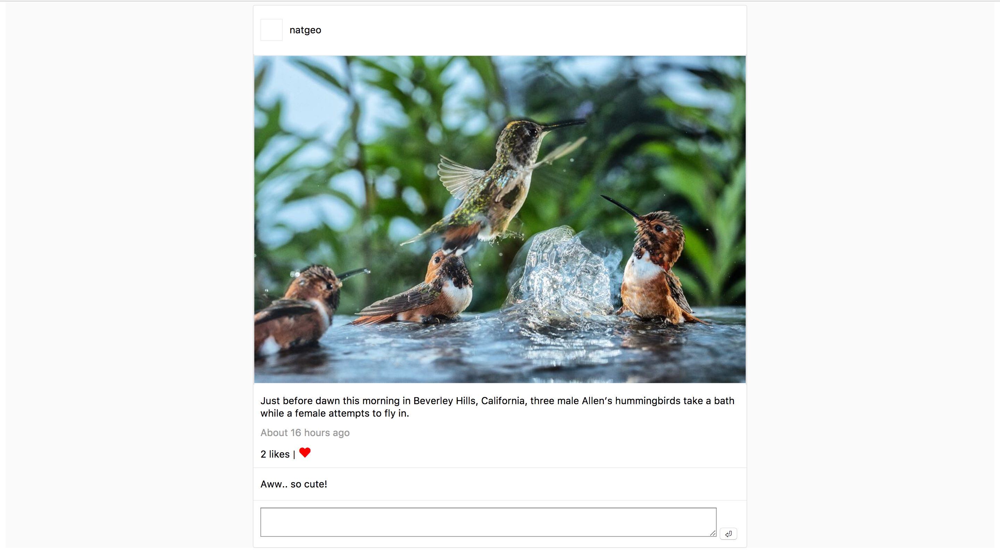

Instagram Challenge
---

This project implements the following functionalities
* An Instagram user can post a picture with a description
* An Instagram user can comment on a picture
* An Instagram user can like a picture
* A post displays the following
  * username of the user who made the post
  * a picture
  * time when the post was made as a function of 'time ago'
  * number of times a post has been liked
  * comments made on the post
* A user can sign up with email, user name and password
* A user can log in
* A user can log out
* Helpful notices and error messages
* Possibly more user management features that came with devise but haven't been tested


Instructions
---

```
$ git clone https://github.com/aballal/instagram-challenge.git
$ cd instagram-challenge
$ bundle install
$ brew install imagemagick
$ rake db:setup
$ bin/rails s
$ open http://localhost:3000
```

`$ rspec` for tests


Screenshots
---


