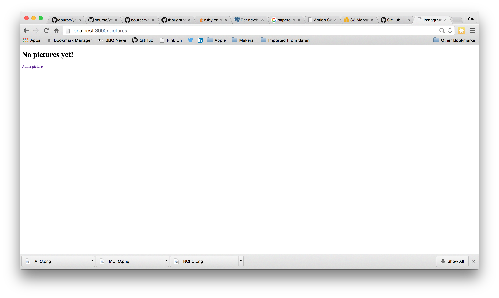
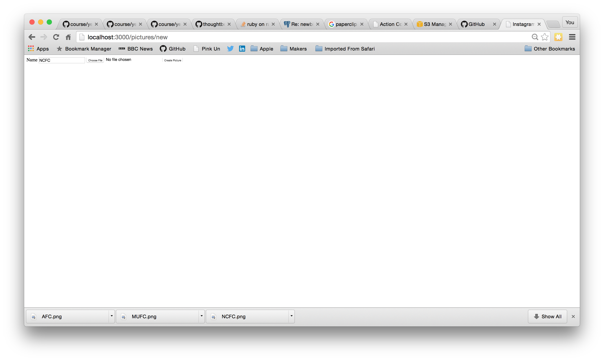
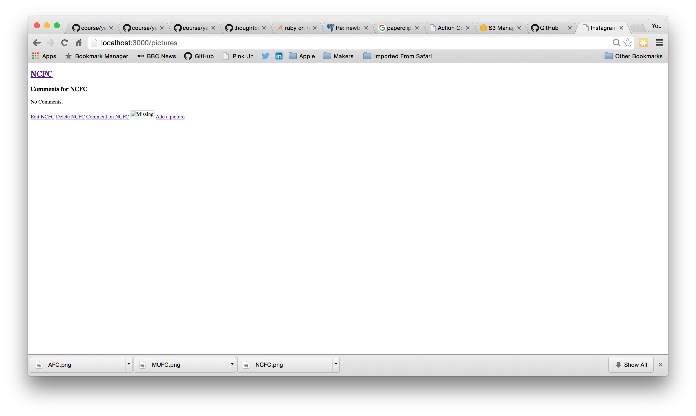
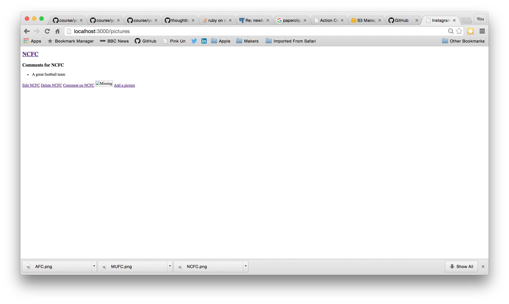
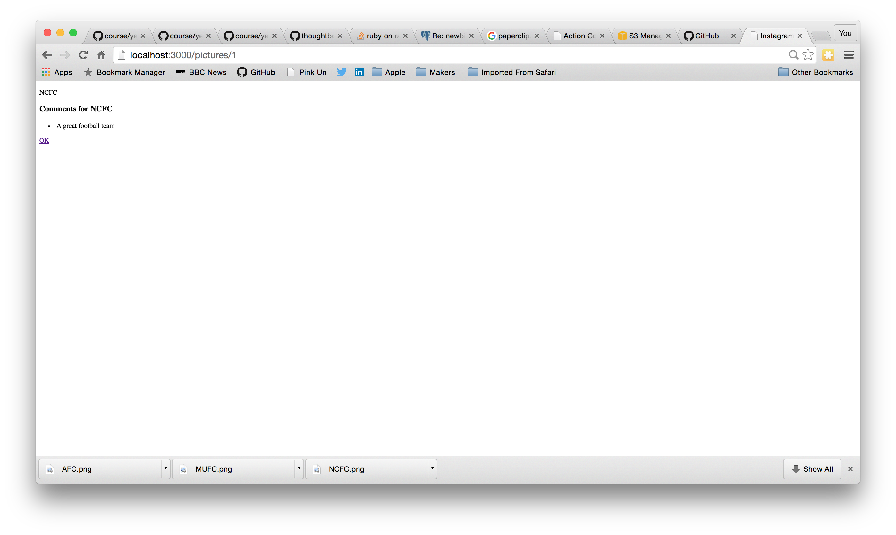
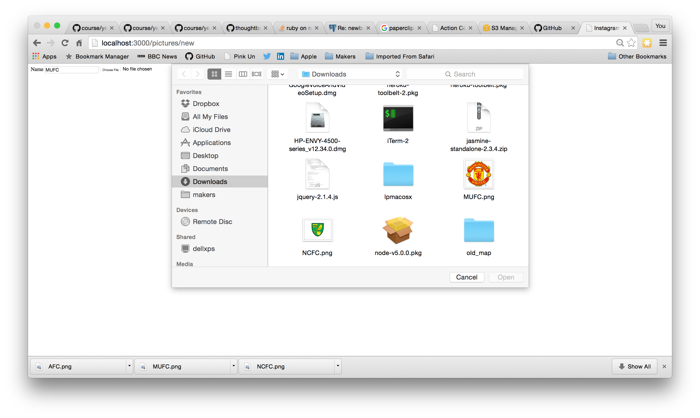
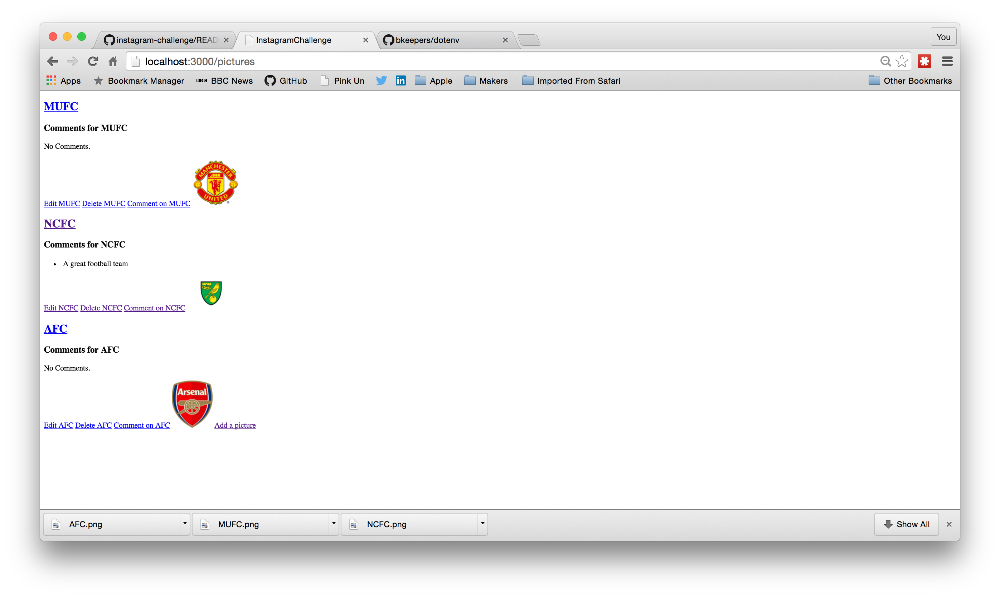

Instructions to run Instragram Challenge
========================================
* bundle install
* Create .env file with appropriate settings for
  * S3_BUCKET_NAME
  * AWS_ACCESS_KEY_ID
  * AWS_SECRET_ACCESS_KEY
* bin/rails server

Current Status of Instagram Challenge
=====================================

The features implemented so far are
* users can add pictures
* write comments about picture

Below are attached the screen shots of the application:

Instagram Challenge
===================

Instructions
-------
* Challenge time: one weekend
* Feel free to use Google, your notes, books, etc., but work on your own
* If you refer to the solution of another coach or student, please put a link to that in your README
* If you have a partial solution, **still check in a partial solution**
* You must submit a pull request to this repo with your code by 9am Monday morning

Task
-----

Build Instagram: Simple huh!

Bonus if you can write your own set of sensible user stories!

As usual please start by forking this repo. After cloning your fork and cd'ing into it, you'll need to [initialize a Rails app in the current directory](http://blog.jasonmeridth.com/posts/create-rails-application-in-current-directory/).

Your challenge is to build Instagram using Rails. You'll need **users** who can post **pictures**, write **comments** on pictures and **like** a picture. Style it like Instagram's website (or more awesome).

Bonus if you can add filters!
