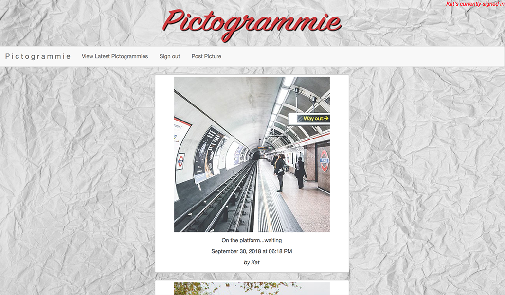
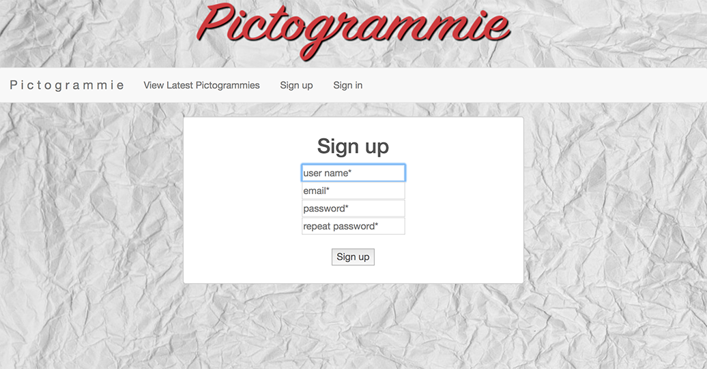

Instagram Challenge
===================

The challenge was to build Instagram using Rails. I needed users who can post pictures, write comments on pictures and like a picture.

I called my clone Pictogrammie.

## User Stories

```
As a user
So that I can view photos of others
I want to be able to view all posts
```
```
As a user 
So that I can view the recent photos first
I want the photos to be posted in reverse chronological order
```
```
As a user
So I can use post my own photos
I want to be able to sign up
```
```
As a user
So that I post my photos
I want to be able to upload a picture
```
```
As a user
So that I can give the photo context
I want to be able to give the photo a caption
```
```
As a user
So that I can show others what photos please me
I want to be able to give a photo a like
```

## Screen Shots





## Set-up

Clone this repo:
 
```
git clone https://github.com/LondonJim/instagram-challenge.git
```
Enter the directory:

```
cd instagram-challenge
```

Install all the relevant gems:

```
bundle
```

Set up the PostgreSQL database:

```
rake db:drop db:create db:migrate db:seed
```

## How to Use

There are currently two ways to use Pictogrammie

#### Local

In terminal enter
`rails s`

Then in your client enter `http://localhost:3000/`

#### Working Deployment

Heroku
`https://pictogrammie.herokuapp.com`

