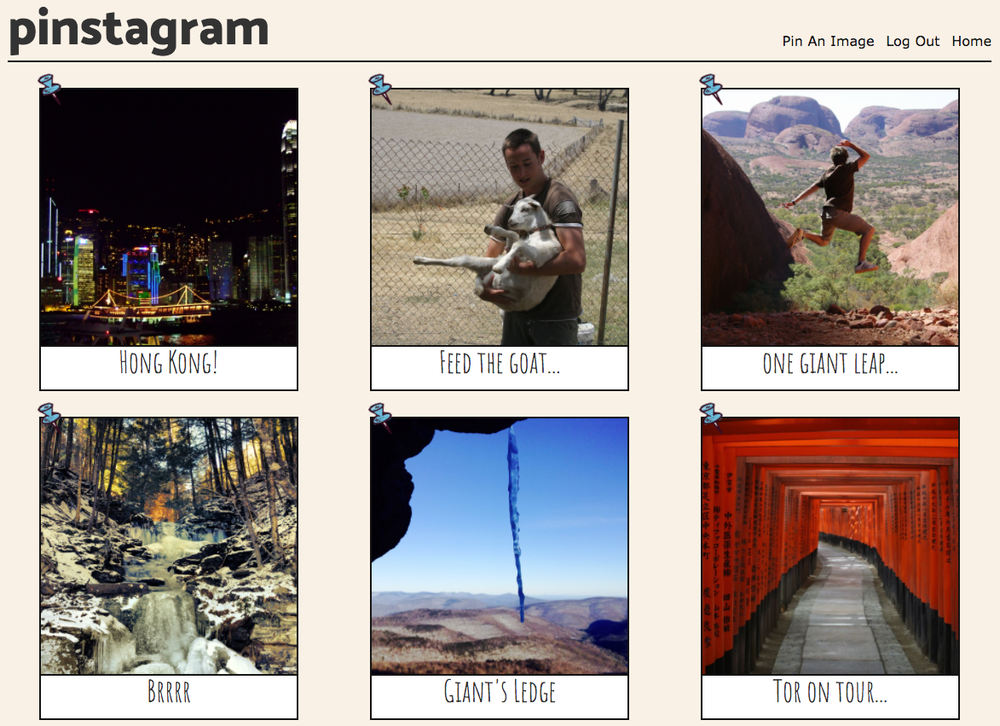
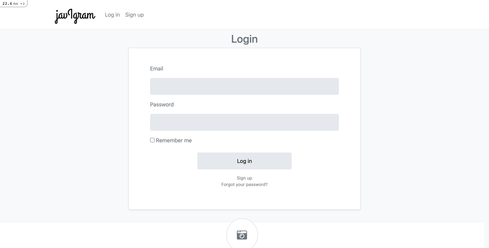

Pinstagram
===================

Find the app at: https://pin-stagram-app.herokuapp.com

 

 

## Technology Used

*  Ruby on Rails
*  Rspec
*  Capybara
*  Devise
*  Postgresql
*  Carrierwave
*  Google Cloud Storage
*  Heroku

## Approach

* CRC Cards and Diagramming
* Using Rails CLI commands to build pin controller, models and views
* Setting up PostgreSQL to persist data
* Integrating file storage with Google Cloud Services
* Implementing Devise to authenticate users and build user model, controller and views
* Adding comments and likes to pin model
* Styling using pure HTML and CSS

## Functionality

A user can:
* Log In/Log Out and Sign Up
* Pin An image
* Comment on an image
* Delete a comment
* Like an image
* See how many likes an image has
* See if you have liked an image

## Future Possibilities

* AJAX
* Unlike an image
* Follow another user
* Tag a user in a comment
* Filter pins by likes/own images/followed etc
* Adding photo filters
