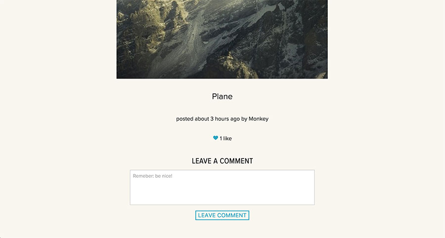

Instagram Challenge
===================

The Challenge
-------------

Build an instagram-esque app in Ruby on Rails for sharing photos.

Users should be able to sign up, post photos, like photos and comment on photos. Development of the app should be test driven.

My Approach:
-------

I began by setting up a new Rails environment, with PostgreSQL databases. I then wrote some simple user stories (below) from which to begin development. Using the user stories, I test-built the app beginning with a Post model, followed by Users (using devise) and working towards an app where Users can log in, post and interact with content, and log out. Users can also sign in via Facebook (using OAuth).

The app uses models for Users, Posts and Comments and Likes.

The app is (almost) fully feature-tested using Capybara and Poltergeist.

Once the functionality was in place I wrote some simple styles for the site, and used Foundation for some quick structure.

Finally, I deployed the app to Heroku.

The app uses Ruby on Rails, PostgreSQL, with Rspec and Capybara for testing. The front end was built using Haml, HTML, SCSS and JavaScript. The typefaces are from TypeKit.


User Stories
------------

`````

As a user
So I can share my experiences with friends and family
I want to be able to upload photos to a public site

As a user
So I can describe what's happening in my photos
I want to be able to add descriptions to my photos

As a user
So I can share in the experiences my friends and family are having
I want to be able to see other people's photos and descriptions

As a user
So I can upload and store my own images the site securely
I want to be able to register a personal account, sign in and sign out.

As a user
So I can log in and out of the site easily
I want to be able to use my Facebook or Twitter accounts to log in

As a user
So I can see which of my photos are most popular
I want visitors to the site to be able to indicate which ones they like

As a user
So I can show people which photos are my favourite
I want to be able to indicate that I like photos I find on the site

As a user
So people can respond to my photos
I want people to be able to add comments to my photos

As a user
So I respond to people's photos
I want to be able to add comments to their photos

As a user
So I know the site is safe and secure
I want only logged-in users to be able to comment on and like my photos

`````

Installing the app:
-------------------

* Fork this repo
* Clone to your local environment
* `cd` into the directory
* run `bundle install`
* run `rake db:create`
* run `rake db:migrate`
* run `rails s`

On Heroku
----------

https://insta-sh.herokuapp.com


Using the app:
--------------

Visit the site:


Sign up for an account:


Log in with Facebook:


Add an image:


Add a comment:



Sign out:


Ideas/To Do:
-------------

* Better error handling
* More testing for edge cases
* More thorough testing of the models
* User profile pictures
* AJAX comments
* Followers for Users
* Tags/taxonomy
