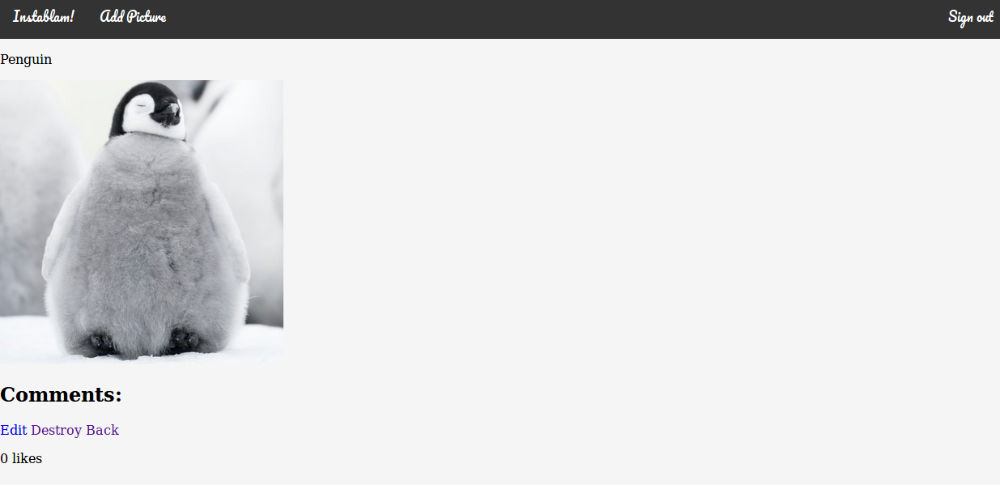

Instagram Challenge
===================

## Task

Build Instagram: Simple huh!

Your challenge is to build Instagram using Rails. You'll need **users** who can post **pictures**, write **comments** on pictures and **like** a picture. Style it like Instagram's website (or more awesome).

Bonus if you can add filters!

## How to run

1. `git clone https://github.com/stilley85/instagram-challenge.git`
2. `cd instablam`
3. `bundle`
4. `rails db:migrate`
5. `rails server`
6. Go to localhost:3000 in your browser.

## How to use

From the landing page you can either sign up, sign in or go straight to browsing images (you won't be able to add images, comment on images or like images without being signed in).

If you choose to sign up fill out your email address and password/password confirmation then hit sign up.

If you chose to sign in fill out your existing email and password and then click Log in.

From the main page you can see all uploaded images and mouseover them to view the number of likes they have. From here you can click on Add Picture to upload a new image, or click on an image to view its page. You can get back to this page at anytime by clicking Instablam! in the navbar.

From the add picture page you need to give your image a title and then select an image to upload using the browse button. Once you have selected an image and given it a title click create picture to upload your image.

On an images page if you are the owner of the image you will be able to view the images comments and likes, but not comment or like the image yourself. You will be able to edit or delete your image from this page.

If you are not the owner of an image you will be able to view the comments and likes on a picture, make a comment or like if you chose to. You can make mulitple comments on a picture but can only like it once.

## My approach

* I began by diagramming the MVC and writing user stories for my app, setting myself a first MVP.
* I then set up Rails and began to work towards my MVP using a TDD approach.
* Once I had reached an MVP I would set myself a new one and work towards this.
* I spent some time reseaching gems to use for this project (Devise, Paperclip).
* I spent some time styling the main pages of my app.

## Further work

If I were to continue this project I would like to add:

* Ability to delete or edit comments.
* The ability to tag and filter images.
* Order images by most/least likes.
* Pagination
* Paperclip and S3 integration.
* Ablity for a user to only see images they have liked or commented on.
* Finish styling all pages.
