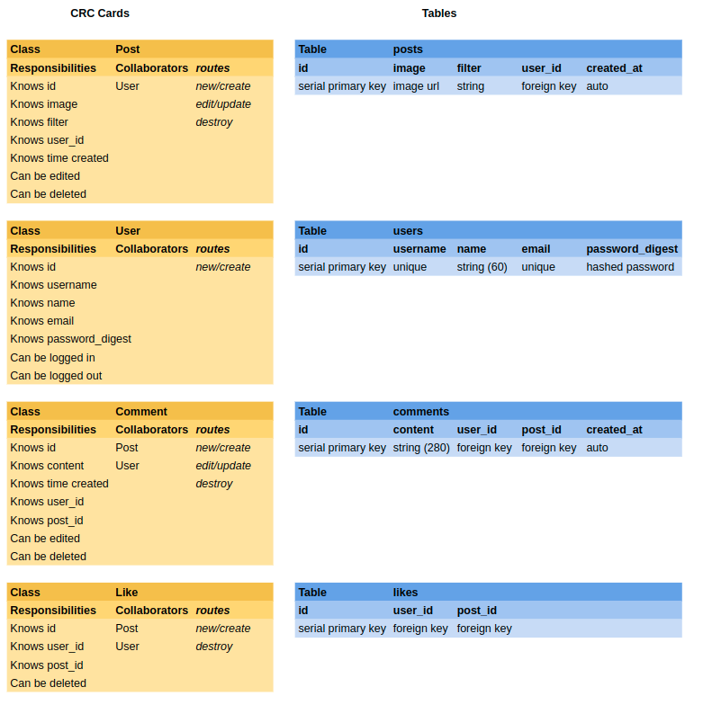

# Instagram Challenge

Build Instagram: Simple huh!

Your challenge is to build Instagram using Rails. You'll need **users** who can post **pictures**, write **comments** on pictures and **like** a picture. Style it like Instagram's website (or more awesome).

Bonus if you can add filters!

## User Stories

I extracted user stories from the short brief above.

### Authentication

> As a Potential User  
> I can sign up for an account  
> So that I can post my own photos

> As a User  
> I can sign in to my account  
> So that I can post photos and make comments as me

> As a Signed In User  
> I can sign out of my account
> So that I can prevent people posting as me

### Posting

> As a Signed In User  
> I can post a photo  
> So everyone can see what I'm doing

> As a Signed In User  
> I can choose from several filters and apply them to my photo  
> So I can express my artistic side

> As a Signed In User  
> I can change the filter on my photo  
> In case I don't like that filter any more

> As a Signed In User  
> I can delete my photos  
> So I can erase embarrassing memories

> As a User  
> I can see a feed of photos, newest to oldest  
> So I can see what is going on with everyone recently

### Commenting

> As a Signed In User  
> I can comment on a photo  
> So I can that user them what I think of it

> As a Signed In User  
> I can edit a comment I have made  
> So I can correct spelling errors

> As a Signed In User  
> I can delete a comment I have made  
> So I can erase embarrassing things I have said

> As a User  
> I can see all comments on a photo from newest to oldest  
> So I can see the freshest opinions on my photo

> As a User  
> I can see the username of who made a comment  
> So I can tell who is interacting with me

> As a User  
> I can see the time a comment was made  
> So I can understand how quickly people commented

### Liking

> As a Signed In User  
> I can like a photo  
> So I can show appreciation without commenting

> As a Signed In User  
> I rescind a like  
> In case I change my mind about liking that photo

> As a User  
> I can see how many likes a photo has  
> So I can estimate my popularity

### Style

> As a Potential User  
> So that I am enticed to join  
> The site should be well styled

## Domain Modelling

Based on the user stories I wrote some CRC cards, and made table schema:



## Development Journal

### Initialising Rails

This project may eventually be deployed to Heroku, so I will initialise it with a Postgresql database, in this repo.

```shell
rails new . --database=postgresql
```

Next I added rspec-rails to the development and test groups in the gemfile, bundled, and isntalled with

```shell
rails generate rspec:install
```

## Code Quality

For linting, you can use the `.rubocop.yml` in this repository (or your own!).
You'll need these gems:

```ruby
gem "rubocop", "0.79.0", require: false
gem "rubocop-rails"
```

You can also lint Javascript, CSS, and ERB — feel free to research this. These
will help you to train yourself to produce cleaner code — and will often alert
you to mistakes or mishaps!
