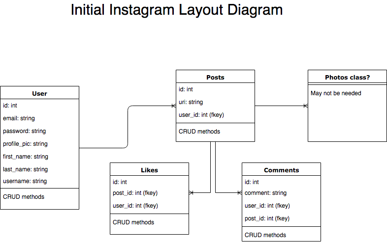

Instagram Challenge
===================

## Instructions for use
- The app is currently deployed at [Heroku](http://ch359-instagram.herokuapp.com)

To build the app yourself, follow these steps:
- Clone the repository
- Install `postgresql` using appropriate instructions for your OS
- Install 'imagemagick' using appropriate instructions for your OS (e.g. `brew install imagemagick`)
- Execute `bundle install` in the root of the project folder to install required gems
- Execute `rails db:create` and `rails db:migrate` in the project root to set up the required databases and tables. 
- If you want some pre-seeded data, also run `rails db:seed`. Details of the accounts and posts created can be found in the `db/seed.rb` file.

To deploy the app to heroku:

- Use their website gui to deploy the github repository
- After deployment, the website will display an error page. 
    - Run `heroku run db:create -a <insert_application_name>` and `heroku run db:migrate -a <insert_application_name>` from the heroku command line to set up the database and resolve this.
    - Note that seeding will not produce working images on production (due to Heroku local storage limitations) and uploaded images will only remain available until the next deployment or restart.    

## Progress made

As this is still my first week with Rails, I encountered many blocking issues due to my lack of knowledge of the framework. As a result, I did not have the time to make the app feature complete. 

The following features are implemented:

- Users can create posts
- Posts can contain photos
- Users can edit and delete posts
- Users own their posts, so cannot delete or edit those from other users
- Users can like posts once
- Posts display a live count of the number of likes
- The main post feed shows resized photos to keep the view manageable.

The following features are not implemented:

- Comments
- Filters for photos
- Website is not designed or styled

## Technical challenges

Too many to list. Triggering javascript on a page to fire off methods in the controller within an erb file and the custom rails form syntax proved very time consuming.
Testing was also particularly challenging:
- I still need to understand more about the principles of testing controller, routes and views within Rails.
- `Devise` testing: currently there are no tests of the User model, controller, routes or views as I decided to move on after spending some time on this.
There are three problems in particular unresolved:
- `spec/views/posts/index.html.erb_spec.rb`: This test was functioning ('mocking' the render of a page?) until I added javascript on the page which references `current_user` (a Devise method).
    - My working hypothesis is that because the page isn't truly loaded, there is no session, therefore no `current_user` - how to avoid this?
- `spec/requests/post_spec.rb`: Couldn't log in successfully, despite including `config.include Devise::Test::IntegrationHelpers, type: :request` in `rails_helper`.
- `spec/features/user_can_like_posts_spec.rb`: After clicking the `like` button on `line 12`, the same lookup to the like counter fails. I have been unable to get visibility on the page in the second part of the test (wish I used Cypress!) - e.g. with `print page.html`. 

## Approach

- Initial diagramming and user stories (see below)
- Mostly TDD, although many of the early commits relate to setup and thus don't include tests.
- Waffle used to track tasks and progress 
- Travis CI, CodeClimate, Rubocop, Rspec and Capybara were used to ensure only clean code was merged to `dev` branch.
- All of the features were added following a cycle:
    - User story created
    - Waffle tickets created
    - Branch made for each issue
    - Feature test added for each user story and some smaller ones
    - Unit tests used where my Rails knowledge was up to the task
    - Feature implemented on branch
    - Tests passed on branch
    - Merge feature branch with dev
    - Once a User Story was completed, merge dev into staging for a test Heroku deployment.
    - Once a manual staging test passes, merge to Master. Automatic Master deployments are enabled.                                   

An illustration of branch workflow:


And an illustration of the waffle board:


## User stories

```
As a user,
So I can live vicariously,
I can view posts containing photos.
```

```
As a user,
So I can share photos of my own,
I can create posts.
```

```
As a user,
So my photos are safe,
They should be associated with my account.
```

```
As a user,
So I can show my appreciation,
I can like posts.
```

```
As a user,
So I can give my opinion,
I can comment on posts.
```

```
As a user,
So I can change my mind,
I can edit my posts.
```

```
As a user,
So I can remove embarrassing photos,
I can delete my posts.
```

```
As a user, 
So I feel comfortable telling my friends about this website,
It is attractively styled.
```

```
As a user,
So I can make my life look even better,
I can use filters to change how my photos look.
```

## Planning



## Skills illustrated

I can learn anything by myself
- Learning Rails concepts, common gems (like Devise) and solidifying MVC
- Continuous development processes and CI

I have a methodical approach to solving problems
- I encountered numerous technical issues throughout the weekend which required extensive troubleshooting to resolve.
- I was successful on most of these, as evidenced by commit history. 

## Instructions

* Challenge time: one weekend
* Feel free to use Google, your notes, books, etc., but work on your own
* If you refer to the solution of another coach or student, please put a link to that in your README
* If you have a partial solution, **still check in a partial solution**
* You must submit a pull request to this repo with your code by 9am Monday morning

## Task

Build Instagram: Simple huh!

Your challenge is to build Instagram using Rails. You'll need **users** who can post **pictures**, write **comments** on pictures and **like** a picture. Style it like Instagram's website (or more awesome).

Bonus if you can add filters!

## How to start

1. Produce some stories, break them down into tasks, and estimate
2. Fork this repo, clone, etc
3. Initialize a new rails project

Remember to proceed in small steps! Getting confused? Make the steps even smaller.

## Code Quality

For linting, you can use the `.rubocop.yml` in this repository (or your own!).
You'll need these gems:

```ruby
gem "rubocop", "0.48.1"
gem "rubocop-rails"
```

You can also lint Javascript, CSS, and ERB — feel free to research this. These
will help you to train yourself to produce cleaner code — and will often alert
you to mistakes or mishaps!
