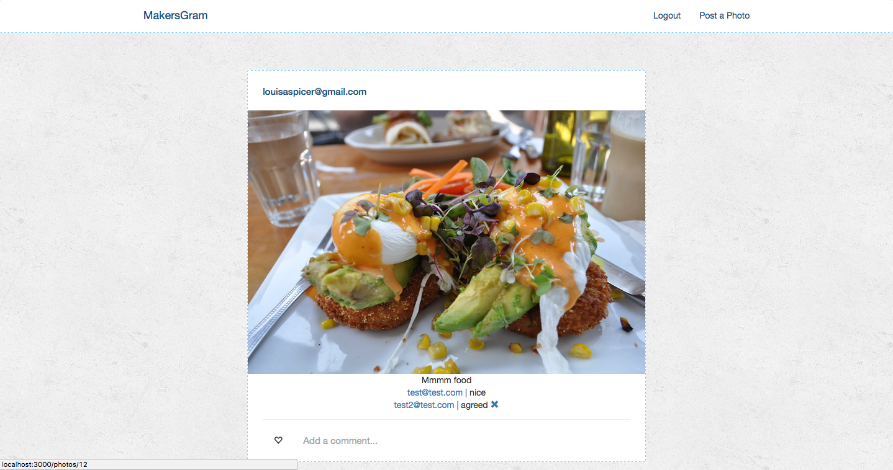

Weekend Challenge 8 - Instagram Challenge
=================

Instagram-inspired app.
Deployed on Heroku:  
https://louisa-makersgram.herokuapp.com/



Functionality:
-----
* Users can register with an email and password
* Users can sign in with their facebook account (locally, as below)
* Users can upload a photo with a caption
* Users can edit and delete their own photos
* Users can comment on each others photos

How to Install:
-----
* Clone this repo https://github.com/louisaspicer/
* Run `bundle` to install the gems
* Run `bin/rake db:create to create the database
* Run `bin/rake db:migrate` to migrate the database
* Run `bin/rails s` to kickstart the server
* Go to http://localhost:3000 to see the fully-functioning app


Improvements to be made:
-----
* Fix Heroku Facebook login - only works on local server
* Use AJAX for commenting
* Refactor code into partials
* Add 'likes' functionality
* Add 'followers'
* Host photos on Amazon Web Services

User Stories:
-----
```
As a User,
So that I can post photos,
I would like to be able to sign up
```
```
As a User,
So that it's easier to sign up
I would like to be able to log in with my Facebook account
```
```
As a User,
So that I can show other users my favourite pictures,
I would like to be able to upload a photo
```
```
As a User,
So that I can describe my photo,
I would like to be able to add a caption
```
```
As a User,
So that I'm not worried if I upload the wrong photo,
I would like to be able to delete my photo
```
```
As a User,
So that I can let other users know what I think,
I would like to be able to leave comments
```
```
As a User,
So that I can see all the comments on a photo,
I would like to be able to view a single photo on a page
```
```
As a User,
So that I can change the caption if I need to,
I would like to be able to edit my own photo
```
```
As a User,
So that my photos are safe,
Only I should be able to edit and delete my photos
```

#### Yet to be implemented:
```
As a User,
So that I can easily show my appreciation for a photo,
I would like to be able to click a 'like' button
```
```
As a User,
So that I can see how many likes my photo has,
I would like it to display the number under my photo
```

```
As a User,
So that I can see all the pictures I have posted,
I would like to have a profile page
```
```
As a User,
So that I can choose what photos are on my homepage,
I would like to be able to 'follow' other users
```

## Authors
[Louisa Spicer](https://github.com/louisaspicer)
